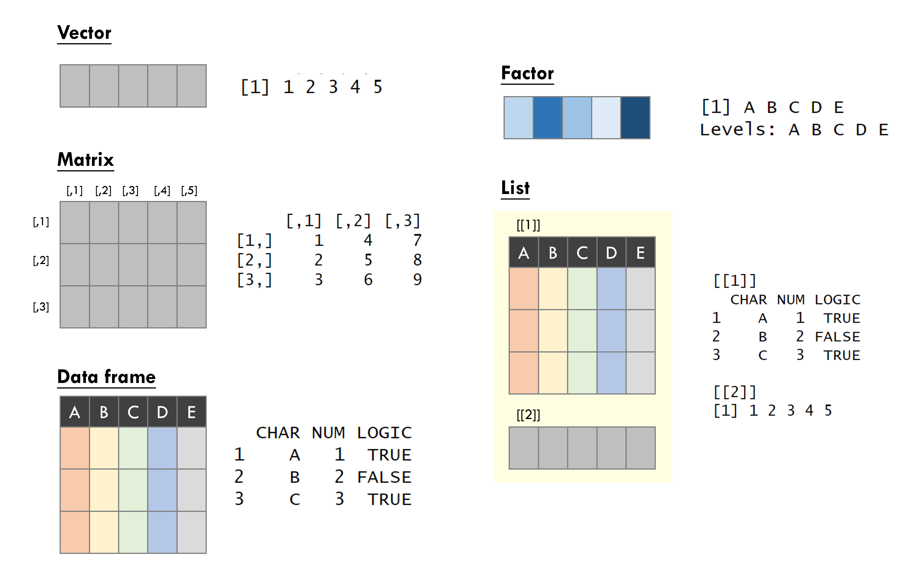
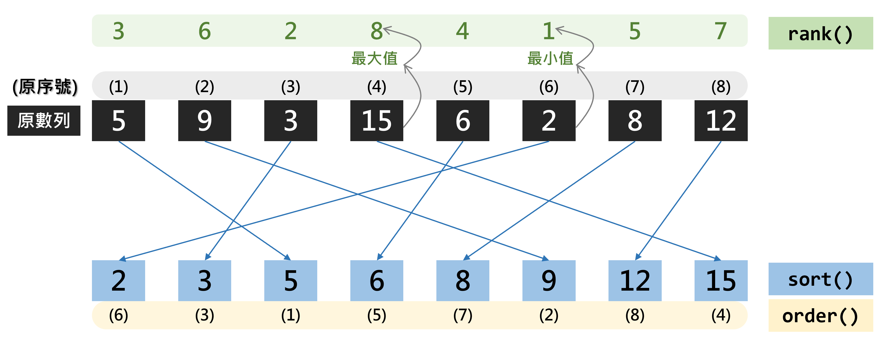
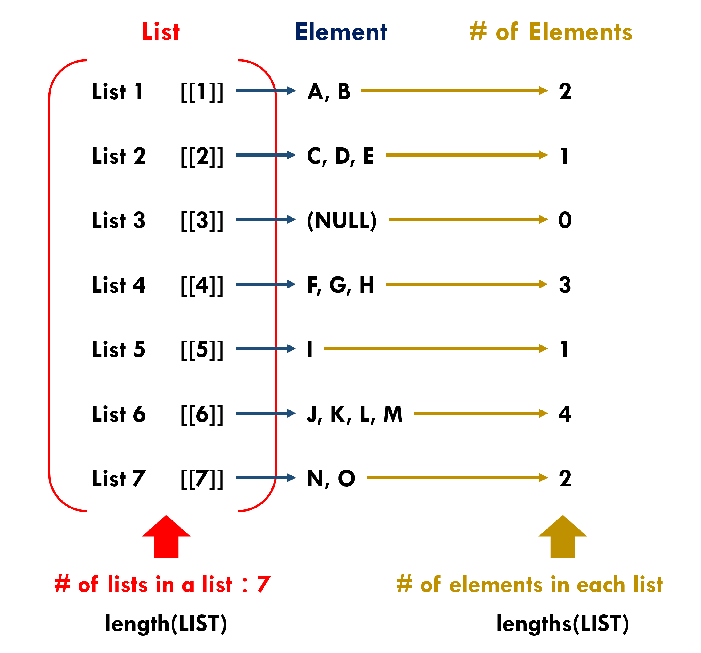
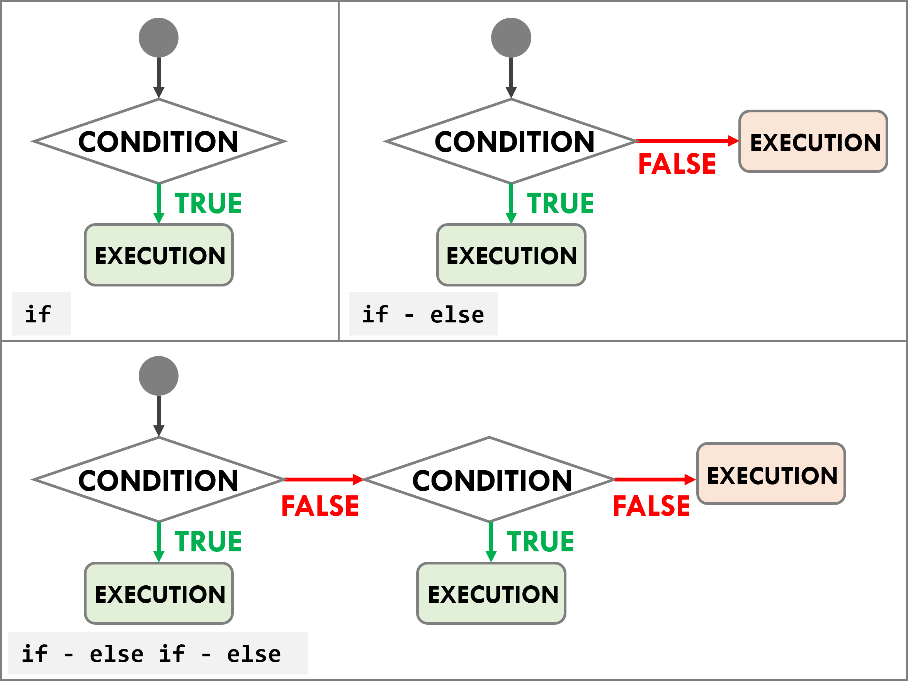
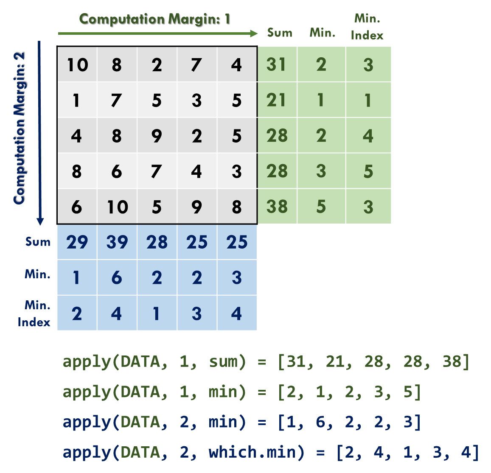

```{r setup1, include=FALSE}
knitr::opts_chunk$set(echo = TRUE)
library(dplyr)
library(data.table)
library(sf)
library(ggplot2)
library(ggsflabel)
library(ggspatial)
library(knitr)
library(kableExtra)
library(TDX)
library(DT)
library(stringr)
library(jsonlite)
library(xml2)
library(lubridate)

Sys.setlocale(category = "LC_ALL", locale = "en")

windowsFonts(A=windowsFont("Serif"))
```

<!--#description This chapter systematically introduces the basic syntax of the R software, including data types, objects, text processing methods, control flow, and methods for data import and export. -->

# (PART\*) Basic Data Analysis {-}

# **Basic Syntax in R**
This chapter provides a systematic introduction to the foundational syntax of R, covering data structures (objects), string manipulation, control flow, and data import/export. Mastering the functions associated with these objects is a critical step toward developing code in subsequent chapters.

## Object
Objects are the fundamental elements used to store data in R. The most common types include the following:

1.  [Vector](#vector)  
2.  [Factor](#factor)  
3.  [Matrix](#matrix)  
4.  [Data frame](#data-frame)  
5.  [List](#list)  
6.  [Date and time](#date-and-time)

Objects can be illustrated as shown in \@ref(fig:object-fig)。

```{r object-fig, echo=F, eval=T, out.width="80%", fig.align="center", fig.cap="Objects in R"}

```


The following sections provide a detailed explanation of the construction and operations of each object.

### Vector
<p style="color:#003D79;font-size:18px;line-height:2">**⌾ Characteristics**</p>  

* a collection of values  
* one-dimensional structure  
* values can be numeric, character (string), and logical    

<p style="color:#003D79;font-size:18px;line-height:2">**⌾ Construction**</p>  

A vector can be created using the `c()` function.  

<p style="font-size:18px;line-height:1">**<u>Numeric vector</u>**</p>  
```{r vector1, echo=T, eval=F}
vec1=c(1,2,3,4,5)
```

```{r vector1-show, echo=F, eval=T}
vec1=c(1,2,3,4,5)
vec1
```

<p style="font-size:18px;line-height:1">**<u>Character vector</u>**</p>  
```{r vector2, echo=T, eval=F}
vec2=c("A","B","C","D","E")
```

```{r vector2-show, echo=F, eval=T}
vec2=c("A","B","C","D","E")
vec2
```

<p style="font-size:18px;line-height:1">**<u>Logical vector</u>**</p>  
```{r vector3, echo=T, eval=F}
# Use abbreviation (T,F) of the logical values
vec3=c(T,F,T,F,T)

# Or specify the logical values using their complete names
vec3=c(TRUE,FALSE,TRUE,FALSE,TRUE)
```

```{r vector3-show, echo=F, eval=T}
vec3=c(T,F,T,F,T)
vec3
```

<p style="color:#003D79;font-size:18px;line-height:2">**⌾ Extract the elements in the vector**</p>  

<p style="font-size:18px;line-height:1">**<u>Extract a single element</u>**</p>  
```{r vector-retrieve1, echo=T, eval=T}
vec2[3]
```

<p style="font-size:18px;line-height:1">**<u>Extract multiple and continuous elements</u>**</p>  
```{r vector-retrieve2, echo=T, eval=T}
vec2[2:4]
```

<p style="font-size:18px;line-height:1">**<u>Extract multiple and noncontinuous elements</u>**</p>  
```{r vector-retrieve3, echo=T, eval=T}
vec2[c(1,3,5)]
```

<p style="font-size:18px;line-height:1">**<u>Extract elements by logical vector</u>**</p>  
Note that the length of the logical vector must be the same as that of the original vector.  
```{r vector-retrieve4, echo=T, eval=T}
vec2[c(T,T,F,F,T)]
```


<p style="color:#003D79;font-size:18px;line-height:2">**⌾ Sequence vector**</p> 
A sequence vector can be generated using the `seq()` function, as shown in the following code. The argument `from=` specifies the starting point of the vector, while `to=` is the ending point. The argument `by=` determines the step size (i.e., the rate of increase or decrease) of the sequence.  

```{r vector-continuous0, echo=T, eval=F}
seq(from=START, to=END, by=VALUES)
```

```{r vector-continuous1, echo=T, eval=T}
seq(from=2, to=20, by=2)
```

<p style="color:#003D79;font-size:18px;line-height:2">**⌾ Vector computations**</p>  

<p style="font-size:18px;line-height:1">**<u>Basic statistics</u>**</p>  

The following example creates a vector `vec4`. The corresponding code and results of the operations are shown in Table \@ref(tab:vector-operation-table).

```{r vector-exg1, echo=T, eval=T}
vec4=c(5,9,3,15,6,2,8,12)
```


```{r vector-operation-table, echo=F, eval=T}
vector_operation=data.frame(ope_name=c("Maximum","Minimum","Index of the maximum value","Index of the minimum value","Range","Sum","Average","Median","Product","Variance","Standard Deviation"), operation=c("`max(vec4)`","`min(vec4)`","`which.max(vec4)`","`which.min(vec4)`","`range(vec4)`","`sum(vec4)`","`mean(vec4)`","`median(vec4)`","`prod(vec4)`","`var(vec4)`","`sd(vec4)`"),
                         result=c(paste0("`", max(vec4), "`"), paste0("`", min(vec4), "`"), paste0("`", which.max(vec4), "`"), paste0("`", which.min(vec4), "`"), paste0("`", paste(range(vec4), collapse="  "), "`"), paste0("`", sum(vec4), "`"), paste0("`", mean(vec4), "`"), paste0("`", median(vec4), "`"), paste0("`", prod(vec4), "`"), paste0("`", round(var(vec4), 3), "`"), paste0("`", round(sd(vec4), 3), "`")))

colnames(vector_operation)=c("Computation","Code","Result")
kable(vector_operation, booktabs=T, caption="Basic statistics of vector")%>%
  kable_styling(bootstrap_options=c("striped", "hover"), font_size=14)%>%
  column_spec(1, bold=T)%>%
  row_spec(0, bold=T, color="white", background="#8E8E8E")
```

Most of the functions mentioned above enable the argument `na.rm=` to be specified, which determines whether `NA` values should be ignored. If `NA` values are present in the data and this argument is not specified, the result will also be `NA`. An example is shown below:

```{r vector-exg-na, echo=T, eval=T}
vec_na=c(1,2,NA,3,4)

# without specifying argument na.rm
sum(vec_na)

# specifying argument na.rm=T
sum(vec_na, na.rm=T)
```


<p style="font-size:18px;line-height:1">**<u>Numeric computation</u>**</p>  

The following example uses `vec4` and a newly created vector `vec5`. The corresponding code and results of all operations are presented in Table \@ref(tab:vector-calculation-table).
```{r vector-exg2, echo=T, eval=T}
vec5=c(0.57,4.28,-1.23,6.58,-4.67,2.09)
```

```{r vector-calculation-table, echo=F, eval=T}
vector_calculation=data.frame(ope_name=c("Absolute value", "Square root", "Round", "Truncate", "Floor", "Logarithm", "Exponential", "Standardisation", "Cumulative sum"), operation=c("`abs(vec5)`","`sqrt(vec4)`","`round(vec5, digits=1)`","`ceiling(vec5)`","`floor(vec5)`","`log(vec4)`","`exp(vec4)`","`scale(vec4)`","`cumsum(vec4)`"),
                         result=c(paste0("`", paste(abs(vec5), collapse=" "), "`"), paste0("`", paste(round(sqrt(vec4), 3), collapse=" "), "`"), paste0("`", paste(round(vec5, digits=1), collapse="  "), "`"), paste0("`", paste(ceiling(vec5), collapse=" "), "`"), paste0("`", paste(floor(vec5), collapse=" "), "`"), paste0("`", paste(round(log(vec4), 3), collapse=" "), "`"), paste0("`", paste(round(exp(vec4), 1), collapse=" "), "`"), paste0("`", paste(round(scale(vec4), 3), collapse=" "), "`"), paste0("`", paste(cumsum(vec4), collapse=" "), "`")))

colnames(vector_calculation)=c("Computation","Code","Result")
kable(vector_calculation, booktabs=T, caption="Numeric computation")%>%
  kable_styling(bootstrap_options=c("striped", "hover"), font_size=14)%>%
  column_spec(1, bold=T)%>%
  row_spec(0, bold=T, color="white", background="#8E8E8E")
```


<p style="color:#003D79;font-size:18px;line-height:2">**⌾ Length of vector**</p>  
Calculate the number of elements in a vector.  
```{r vector-length, echo=T, eval=T}
length(vec4)
```

<p style="color:#003D79;font-size:18px;line-height:2">**⌾ Frequency count of elements in a vector**</p>  
Calculate the frequency of each element in a vector.  
```{r vector-table, echo=T, eval=T}
vec_tab=c("A","C","B","D","E","C","E","B","A","E","E","B")
table(vec_tab)
```

<H2 id="vector-sort"><p style="color:#003D79;font-size:18px;line-height:2">**⌾ Sequence of a vector**</p></H2>

* The `sort()` function sorts a vector in ascending order.  
* The `order()` function returns the indices of the original vector that correspond to the ascending order.  
* The `rank()` function returns the rank of each element in the vector from smallest to largest.  

The code is written as follows; see the illustration in Figure \@ref(fig:vector-sort-order-rank-fig).  

```{r vector-sort-order-rank-fig, echo=F, eval=T, out.width="90%", fig.align="center", fig.cap="Illustration of sort, orderm and rank"}

```

```{r vector-sort-order-rank, echo=T, eval=T}
sort(vec4)
order(vec4)
rank(vec4)
```
 
From the result of `sort()`, we can see that the vector `vec4` is sorted in ascending order. The `order()` function returns the indices of the original vector corresponding to this sorted order. For example, the last value in the returned result is `4`, indicating that the largest value in the vector is located at the 4th position of the original vector. Based on this result, we can also obtain the same output as `sort()` using the following code.

```{r vector-sort-order-eg, echo=T, eval=T}
vec4[order(vec4)]
```

Lastly, `rank()` returns the rank of each element in the vector. For example, the first element `5` in `vec4` has a rank of `3`, meaning that it is the third smallest value in the vector.

<p style="color:#003D79;font-size:18px;line-height:2">**⌾ Unique values in a vector**</p>  
The `unique()` function can remove the duplicated values.  
```{r vector-unique, echo=T, eval=T}
vec_dup=c(1,9,5,2,6,1,8,5,2)
unique(vec_dup)
```


<p style="color:#003D79;font-size:18px;line-height:2">**⌾ Check whether `NA` values are present**</p>  
The `is.na()` function checks whether an element is `NA` and returns a logical value.
```{r vector-na, echo=T, eval=T}
vec_na=c(1,9,5,NA,6,NA)
is.na(vec_na)
```

<H2 id="vector-computation"><p style="color:#003D79;font-size:18px;line-height:2">**⌾ Arithmetic operations on vectors**</p></H2>

The following example demonstrates vector arithmetic using `vec4` and a newly created vector `vec6`.  
```{r vector-vec5, echo=T, eval=T}
vec6=c(2,5,8,11,7,4,10,3)
```


<H2 id="vector-compute"><p style="font-size:18px;line-height:1">**<u>Operations on two vectors</u>**</p></H2>
When performing operations on two vectors, the lengths (`length()`) of both vectors must be the same.  
The results of all operations are shown in Table \@ref(tab:vector-arithmetic-table).  

```{r vector-arithmetic-table, echo=F, eval=T}
vector_arithmetic=data.frame(ope_name=c("","Addition", "Subtraction", "Multiplication", "Division", "Remainder", "Quotient", "Inner product"), operation=c("", "`vec4+vec6`","`vec4-vec6`","`vec4*vec6`","`vec4/vec6`","`vec4 %% vec6`","`vec4 %/% vec6`","`vec4 %*% vec6`"), result=c("", paste0("`", paste(vec4+vec6, collapse=" "), "`"), paste0("`", paste(vec4-vec6, collapse=" "), "`"), paste0("`", paste(vec4*vec6, collapse=" "), "`"), paste0("`", paste(round(vec4/vec6, 3), collapse=" "), "`"), paste0("`", paste(vec4 %% vec6, collapse=" "), "`"), paste0("`", paste(vec4 %/% vec6, collapse=" "), "`"), paste0("`", paste(vec4 %*% vec6, collapse=" "), "`")))
vector_arithmetic$result[1]="**`vec4=c(5,9,3,15,6,2,8,12)`\\\n`vec6=c(2,5,8,11,7,4,10,3)`**"

colnames(vector_arithmetic)=c("Computation","Code","Result")
kable(vector_arithmetic, booktabs=T, caption="Arithmetic operations")%>%
  kable_styling(bootstrap_options=c("striped", "hover"), font_size=14)%>%
  column_spec(1, bold=T)%>%
  row_spec(0, bold=T, color="white", background="#8E8E8E")
```


<p style="font-size:18px;line-height:1">**<u>Vector–scalar operations</u>**</p>  
Operations between a vector and a scalar apply the operation to each element of the vector with that scalar.  
```{r vector-addition2, echo=T, eval=T}
vec6+5
vec6*5
```


<p style="color:#003D79;font-size:18px;line-height:2">**⌾ Check whether each element in a vector is contained in another vector**</p>  
Check whether each element in the vector `vec6` is contained in the vector `c(1, 2, 3)`. 
```{r vector-contain, echo=T, eval=T}
vec6 %in% c(1,2,3)
```


<p style="color:#003D79;font-size:18px;line-height:2">**⌾ Data type conversion**</p>  

<p style="font-size:18px;line-height:1">**<u>Convert character to numeric</u>**</p>  
Create a character vector `vec_cha`.

```{r vector-convert1, echo=T, eval=T}
vec_cha=c("1","2","3","4","5")
```

First, use the `class()` function to check the data type of `vec_cha`.  
```{r vector-convert2, echo=T, eval=T}
class(vec_cha)
```

Use the `as.numeric()` function to convert the data to numeric values.  
```{r vector-convert3, echo=T, eval=T}
as.numeric(vec_cha)
```

<p style="font-size:18px;line-height:1">**<u>Convert numeric to character</u>**</p>  
Alternatively, the `as.character()` function can be used to convert the data to character values.  
```{r vector-convert4, echo=T, eval=T}
vec_num=c(1,2,3,4,5)
as.character(vec_num)
```


<p style="color:#003D79;font-size:18px;line-height:2">**⌾ Create repeated data**</p> 
Repeated values can be generated using the `rep()` function. This function mainly includes two arguments:  

* `each=` specifies the number of times each element is repeated  
* `times=` specifies the number of times the entire vector is repeated

An example is provided below, and the corresponding code is written as follows:  
```{r vector-repeat, echo=T, eval=T}
vec6=c(2,5,8,11,7,4,10,3)

# specify the number of times each element in vec6 is repeated
rep(vec6, each=2)

# specify the number of times the entire vector vec6 is repeated
rep(vec6, times=2)
```


<p style="color:#003D79;font-size:18px;line-height:2">**⌾ Return the indices of TRUE values in a vector**</p>   

<p style="font-size:18px;line-height:1">**<u>Indices of TRUE</u>**</p>  
The `which()` function returns the indices of `TRUE` values in a vector.
```{r vector-which1, echo=T, eval=T}
vec3=c(T,F,T,F,T)
which(vec3)
```

From the example above, the `TRUE` values are located at the 1st, 3rd, and 5th elements of the vector `vec3`.


<p style="font-size:18px;line-height:1">**<u>Return the indices that satisfy a condition</u>**</p>  
In addition to the basic examples above, operators (e.g., `==`, `>`, `<`, ...) can be used to identify elements that satisfy specific conditions. The `which()` function can then be used to return the indices of elements for which the result is `TRUE`. An example is shown below.

```{r vector-which2, echo=T, eval=T}
vec6=c(2,5,8,11,7,4,10,3)

# logical test for whether elements of `vec6` are greater than 5
vec6>5

# retrieve the indices for the elements in `vec6` are greater than 5
which(vec6>5)
```


### Factor
<p style="color:#003D79;font-size:18px;line-height:2">**⌾ Characteristics**</p>  

* created from a character vector  
* requires specifying factor levels  
* extended applications of factors:  
  * adjusting legend order in the plot using `ggplot2` package  
  * creating dummy variables in econometric models


<p style="color:#003D79;font-size:18px;line-height:2">**⌾ Construction**</p>   
Factors can be created using the `factor()` function, where the levels must be specified using the `levels=` argument. The code is constructed as follows:

```{r factor1, echo=T, eval=F}
factor(CHARACTER VECTOR, levels=LEVELS)
```

An example is provided below by creating a character vector `age`.

```{r factor2, echo=T, eval=T}
age=c("Teen","Senior","Childhood","Toddler","Adulthood")
```

To convert `age` into a factor with ordered levels and arrange it according to the age hierarchy, the code is written as follows:

```{r factor3, echo=T, eval=T}
age_fc=factor(age, levels=c("Toddler","Childhood","Teen","Adulthood","Senior"))
age_fc
```

From the above example, we can observe that, unlike a character vector, a factor displays an additional message "Levels", indicating that the values have categorical levels.  

Finally, the `is.factor()` function can be used to determine whether a variable is a factor, or the `class()` function can be used to directly check the data type of the variable.  

```{r factor5, echo=T, eval=T}
is.factor(age_fc)
class(age_fc)
```

Since factors have ordered levels, they can be sorted. The <A href="#vector-sort">`sort()`</A> function can be used to perform the sorting, as shown in the following code:  
```{r factor-sort, echo=T, eval=T}
sort(age_fc)
```

<p style="color:#003D79;font-size:18px;line-height:2">**⌾ Ordered factor**</p>   
The factor created above has ordered levels and therefore can be sorted. However, the elements themselves do not carry numerical magnitude and cannot be directly compared in terms of size. For example, in `age_fc`, the level "Senior" is defined as higher than "Teen". This ordering only indicates the hierarchy of categories and does not imply that `Senior > Teen`. Therefore, if two elements are compared directly using comparison operators, R will generate a warning (indicating that ordering comparisons are not meaningful for factors) and return `NA`. A demonstration is shown below.

```{r factor-error, echo=T, eval=T}
age_fc[1]>age_fc[2]
```

To create a factor with an inherent ordering, the argument `ordered=TRUE` must be specified in the `factor()` function to indicate that the levels have an ordinal relationship.

```{r factor-order1, echo=T, eval=T}
age_order=factor(age, levels=c("Toddler","Childhood","Teen","Adulthood","Senior"), order=T)
age_order
```

From the output, we can observe that the symbol "<" appears between the levels, indicating an ordered relationship among them. The numeric operation can also be applied once the order is created.

```{r factor-order2, echo=T, eval=T}
# compare the ordering between "Teen" and "Senior".
age_order[1]>age_order[2]
```

<p style="color:#003D79;font-size:18px;line-height:2">**⌾ Convert data format of a factor**</p>   
A factor can be converted to a character vector using `as.character()`. It can also be converted to numeric values using `as.numeric()`, where the numeric values correspond to the order of the levels; the higher the level, the larger the assigned value. The following example illustrates this using `age_fc`.

```{r factor-char-num, echo=T, eval=T}
# convert to character
as.character(age_fc)

# convert to numeric
as.numeric(age_fc)
```


### Matrix
<p style="color:#003D79;font-size:18px;line-height:2">**⌾ Characteristics**</p>  

* two-dimensional  
* consists of multiple rows and columns  
* combines vectors of the same data type (character, numeric, or logical vectors)

<p style="color:#003D79;font-size:18px;line-height:2">**⌾ Construction**</p>  
A matrix can be created using the `matrix()` function, where two arguments must be specified:

* `nrow=` specifies the number of rows in the matrix  
* `ncol=` specifies the number of columns in the matrix

```{r matrix-function, echo=T, eval=F}
matrix(VECTOR, nrow=, ncol=)
```

Using a numeric vector 1 to 15 for example to create a matrci as follows.

```{r matrix1, echo=T, eval=T}
mat1=matrix(c(1:15), nrow=3, ncol=5)
mat1
```

From the returned result, we can observe that the matrix is filled column-wise, that is, from top to bottom and then from left to right. If the matrix should instead be filled row-wise (from left to right and then from top to bottom), the argument `byrow=TRUE` must be specified. The code is written as follows.

```{r matrix2, echo=T, eval=T}
mat2=matrix(c(1:15), nrow=3, ncol=5, byrow=T)
mat2
```

<p style="color:#003D79;font-size:18px;line-height:2">**⌾ Matrix dimensions**</p>  
A matrix is a two-dimensional data structure. To examine the number of rows and columns in the matrix, the functions `nrow()` and `ncol()` can be used, respectively, or the `dim()` function can be used to view both dimensions directly.

```{r matrix3, echo=T, eval=T}
nrow(mat2)
ncol(mat2)
dim(mat2)
```

<p style="color:#003D79;font-size:18px;line-height:2">**⌾ Extract a specific element in a matrix**</p>  
Square brackets `[ , ]` can be used to return the value of a specific element. The index before the comma indicates the row, while the index after the comma indicates the column. For example, to access the element in the 2nd row and 4th column, the code is written as follows.

```{r matrix4, echo=T, eval=T}
mat2[2, 4]
```

<p style="color:#003D79;font-size:18px;line-height:2">**⌾ Transpose the matrix**</p>  
Use the `t()` function to transpose a matrix.

```{r matrix5, echo=T, eval=T}
t(mat2)
```

<p style="color:#003D79;font-size:18px;line-height:2">**⌾ Matrix computation**</p>  
R provides a powerful and efficient framework for matrix operations, which are essential for many statistical models. This section introduces the key functions used to perform these computations.

<p style="font-size:18px;line-height:1">**<u>Row and column computations</u>**</p>  
The calculations of row and column sums and means are summarised in Table \@ref(tab:matrix-operation-table).

```{r matrix-operation-table, echo=F, eval=T}
matrix_operation=data.frame(TYPE=rep(c("Row","Column"), each=2), sum=c("`rowSums(mat2)`", paste0("`", paste(rowSums(mat2), collapse=" "), "`"), "`colSums(mat2)`", paste0("`", paste(colSums(mat2), collapse=" "), "`")), ave=c("`rowMeans(mat2)`", paste0("`", paste(rowMeans(mat2), collapse=" "), "`"), "`colMeans(mat2)`", paste0("`", paste(colMeans(mat2), collapse=" "), "`")))

colnames(matrix_operation)=c("","Sum","Average")
kable(matrix_operation, booktabs=T, caption="Matrix computation")%>%
  kable_styling(bootstrap_options=c("striped", "hover"), font_size=14)%>%
  column_spec(1, bold=T)%>%
  collapse_rows(c(1:2))%>%
  row_spec(0, bold=T, color="white", background="#8E8E8E")
```


<p style="font-size:18px;line-height:1">**<u>Matrix arithmetic</u>**</p>  
The basic arithmetic operations for matrices are similar to those for <A href="#vector-computation">vectors</A>. However, it is important to note that, for most arithmetic operations, the two matrices must have the same dimensions (`dim()`). Taking matrix addition as an example, the code is as follows.

```{r matrix-addition, echo=T, eval=T}
mat1+mat2
```

The inner product is a common operation in matrix computations and is widely used in the estimation of coefficients in many models. In R, it can be performed using `%*%`. When computing the inner product, the number of columns (`ncol`) of the first matrix must be equal to the number of rows (`nrow`) of the second matrix. Taking `mat1` and `mat2_trans` (the transpose of `mat2`) as an example, the code is shown below.

```{r matrix-product, echo=T, eval=T}
# transpose mat2
mat2_trans=t(mat2)

# check whether the number of columns for mat1 is exactly the same as the number of rows in mat2_trans
ncol(mat1)==nrow(mat2_trans)

# inner product
mat1 %*% mat2_trans
```

Please note that `mat1` has dimensions of 3 rows and 5 columns, while `mat2_trans` has dimensions of 5 rows and 3 columns. For matrix inner product, the number of columns in the first matrix must be equal to the number of rows in the second matrix. In the example above, the resulting matrix from the inner product has dimensions of `3 × 3`.


### Data Frame
<p style="color:#003D79;font-size:18px;line-height:2">**⌾ Characteristics**</p>  

* Similar to a matrix, but can store different data types in columns  
* Works like an Excel worksheet  
* One of the most common data structures in data analysis  
* Can be manipulated using the `dplyr` package (see [Data Tidy and Processing](#data-tidy-and-processing))

<p style="color:#003D79;font-size:18px;line-height:2">**⌾ Construction**</p>  
The data frame can be created using the `data.frame()` function.

```{r dataframe-function, echo=T, eval=F}
data.frame(VAR1=c(), VAR2=c(), VAR3=c(), ...)
```

VAR1, VAR2, and VAR3 in the above code represent the variable names in the data frame, that is, the column headers of the table.

The following simple example illustrates how to construct a data frame.

```{r dataframe1, echo=T, eval=T}
StuScore=data.frame(StudentID=c("ID1","ID2","ID3","ID4","ID5"),
                    Name=c("Bob","Mary","Robert","Jason","Jane"),
                    Score=c(60,80,40,50,100))
StuScore
```


<p style="color:#003D79;font-size:18px;line-height:2">**⌾ Retrieve the column name**</p>  
```{r dataframe2, echo=T, eval=F}
colnames(StuScore)

# or simply using name() function
names(StuScore)
```

```{r dataframe2-show, echo=F, eval=T}
colnames(StuScore)
```

<p style="color:#003D79;font-size:18px;line-height:2">**⌾ Set the column header names**</p>  
Column names can also be set using `colnames()`. The corresponding code is shown below.
```{r dataframe2-1, echo=T, eval=F}
StuScore_rename=StuScore
colnames(StuScore_rename)=c("STUID","SCORE")

StuScore_rename
```


<p style="color:#003D79;font-size:18px;line-height:2">**⌾ Retrieve specific rows/columns**</p>  

<p style="font-size:18px;line-height:1">**<u>Retrieve specific rows</u>**</p>  
Place the row index or logical vector before the comma inside the brackets. When using a logical vector, its length must be the same as the number of rows in the data. The code is written as follows.
```{r dataframe3, echo=T, eval=F}
# use the row index
StuScore[c(1,3,5),]

# sue the logical vector
StuScore[c(T,F,T,F,T),]
```

```{r dataframe3-show, echo=F, eval=T}
StuScore[c(1,3,5),]
```

<p style="font-size:18px;line-height:1">**<u>Retrieve specific columns</u>**</p>  
There are three ways to return specified (multiple) columns, including:

* Column index vector  
* Logical vector  
* Column name vector  

When using a logical vector, its length must be the same as the number of columns in the data. The code is written as follows.

```{r dataframe4, echo=T, eval=F}
# use the index
StuScore[, c(1,2)]

# use the logical vector
StuScore[, c(T,F,T,F,T)]

# use the column name
StuScore[, c("StudentID","Name")]
```

```{r dataframe4-show, echo=F, eval=T}
StuScore[, c("StudentID","Name")]
```

In addition, a data frame can return a specific single column using `$` or `[[""]]`. Note that `[[""]]` uses **double brackets**, which differs from the previous methods. The code is written as follows.

```{r dataframe-retrieve-col, echo=T, eval=F}
DATA$COLUMN

DATA[["COLUMN"]]
```


```{r dataframe5, echo=T, eval=T}
# use $
StuScore$Name

# use [[""]] (double brackets)
StuScore[["Score"]]
```

<p style="color:#003D79;font-size:18px;line-height:2">**⌾ Retrieve and edit a specific element**</p>  

<p style="font-size:18px;line-height:1">**<u>Specify by index</u>**</p>  

```{r dataframe-retrieve-element, echo=T, eval=F}
DATA[ROW_INDEX, COLUMN_INDEX]
```

```{r dataframe6, echo=T, eval=T}
StuScore[2,2]
```

<p style="font-size:18px;line-height:1">**<u>Edit a specific element</u>**</p>  
```{r dataframe7, echo=T, eval=T}
StuScore[2,2]="Jessica"

StuScore
```


<p style="color:#003D79;font-size:18px;line-height:2">**⌾ Look up the first/last six rows**</p>  
Here we use the built-in `iris` dataset in R for illustration. The `iris` dataset contains 150 samples and includes three species of iris flowers (setosa, virginica, and versicolor). The data record the length and width of the petals and sepals.  

<p style="font-size:18px;line-height:1">**<u>Retrieve the first six rows</u>**</p>  
```{r dataframe_head, echo=T, eval=T}
head(iris)
```

<p style="font-size:18px;line-height:1">**<u>Retrieve the last six rows</u>**</p>  
```{r dataframe_tail, echo=T, eval=T}
tail(iris)
```

If retrieve more or less rows, we can specify the argument after the data. For example, the code of retrieving only first 3 rows in the data `iris` is shown below:

```{r dataframe_head2, echo=T, eval=T}
head(iris, 3)
```


<p style="color:#003D79;font-size:18px;line-height:2">**⌾ Augment the data frame**</p>

<p style="font-size:18px;line-height:1">**<u>Append a new row (new record)</u>**</p>  
To add new data, the `rbind()` function can be used to append rows. The code is shown below.

```{r dataframe_rbind, echo=T, eval=T}
# create a new record
new_student=data.frame(StudentID="ID6", Name="Roy", Score=90)

# append the new data by rbind() function
StuScore=rbind(StuScore, new_student)

StuScore
```


<p style="font-size:18px;line-height:1">**<u>Add a new column (new field)</u>**</p>  
To add a new field (column) to the entire data (e.g., adding a gender column to `StuScore`), the `cbind()` function can be used to combine columns. The code is shown below.

```{r dataframe_cbind, echo=T, eval=T}
# create a new field
Gender=c("M","F","M","M","F","M")

# add the new field by cbind() function
StuScore=cbind(StuScore, Gender)

StuScore
```

Alternatively, a new column can be added directly using `$` or `[[""]]`. The code is shown below:
```{r dataframe_add_col-fun, echo=T, eval=F}
DATA$NEW_COLUMN=c(...)

DATA[["NEW_COLUMN"]]=c(...)
```

```{r dataframe_add_col, echo=T, eval=T}
StuScore$Height=c(180,165,170,160,175,180)

StuScore[["Weight"]]=c(60,70,90,55,80,75)

StuScore
```


<p style="color:#003D79;font-size:18px;line-height:2">**⌾ Check duplicated rows**</p>  
For illustration, we first create a data frame that contains duplicate records.

```{r dataframe_duplicated1, echo=T, eval=T}
StuScore_dup=data.frame(StudentID=c("ID1","ID2","ID4","ID3","ID4","ID5","ID2"),
                        Name=c("Bob","Mary","Jason","Robert","Jason","Jane","Mary"),
                        Score=c(60,80,40,100,40,100,80))
StuScore_dup
```

The data `StuScore_dup` contains duplicated rows (ID2 & ID4). We can further check this using the `duplicated()` function.

```{r dataframe_duplicated2, echo=T, eval=T}
duplicated(StuScore_dup)

# use which() function to find the index with duplicated row
which(duplicated(StuScore_dup))
```

As shown in the result, the 5th and 7th records are identified as duplicates. Note that the first occurrence of a row in a data frame is not considered a duplicate.

### List
<p style="color:#003D79;font-size:18px;line-height:2">**⌾ Characteristics**</p>  

* A collection of objects (can include vectors, matrices, data frames, list, etc.)  
* The most complex object type, but highly flexible to use

<p style="color:#003D79;font-size:18px;line-height:2">**⌾ Construction**</p>  
Use `list()` function to create a list.

```{r list1, echo=T, eval=T}
StuScore_list=list(StudentID=c("ID1","ID2","ID3","ID4","ID5"),
                   Name=c("Bob","Mary","Robert","Jason","Jane"),
                   Score=c(60,80,40,50,100),
                   Class="A")
```

```{r list1-show, echo=F, eval=T}
StuScore_list
```


<p style="color:#003D79;font-size:18px;line-height:2">**⌾ Retrieve the attributes in a list**</p>  

<p style="font-size:18px;line-height:1">**<u>Retrieve by `$` or `[[""]]`</u>**</p>  
The attribute of a list can be retrieve by `LIST$ATTRIBUTE` or `LIST[["ATTRIBUTE"]]`.

```{r list2, echo=T, eval=T}
StuScore_list$Score

StuScore_list[["Name"]]
```

<p style="font-size:18px;line-height:1">**<u>Retrive by index</u>**</p>  
```{r list3, echo=T, eval=T}
StuScore_list[[2]]
```


<p style="color:#003D79;font-size:18px;line-height:2">**⌾ Length of a list**</p>  
The length of a vector can be calculated using the `length()` function, and the same applies to list. The code is written as follows.  
```{r list4, echo=T, eval=T}
# create a list
num_list=list(c(1:5), c("A","B","C","D"), c(T,F,T))
num_list

# extract the length of a list
length(num_list)
```

From this, we can see that the length of `num_list` is 3. Moreover, if we want to know the length of each element in the list, we can use the `lengths()` function. The code is written as follows, and the concept of `length()` and `lengths()` are illustrated in Figure \@ref(fig:list-length-fig).

```{r list5, echo=T, eval=T}
# calculate the length of each list in a list
lengths(num_list)
```

From this, we can see that the first array in `num_list` has a length of 5, the second has a length of 4, and the last has a length of 3.

```{r list-length-fig, echo=F, eval=T, out.width="70%", fig.align="center", fig.cap="Illustration of the length of list"}

```

<p style="color:#003D79;font-size:18px;line-height:2">**⌾ Remove the list structure**</p>  
To remove the list structure and return all elements contained in the list, the `unlist()` function can be used.

```{r unlist, echo=T, eval=T}
# Remove the list structure
unlist(num_list)
```


### Date and Time
In data processing, setting proper date and time formats helps with tasks such as calculating time differences and plotting time series data. In R, time data can be handled using the `base` and `lubridate` packages. Note that some functions in these packages share the same names, so it is recommended to specify the package when using them, i.e., `lubridate::XXXX()`.

<p style="color:#003D79;font-size:18px;line-height:2">**⌾ Basic settings**</p>  

Time formats depend on the local computer settings; therefore, they should be specified explicitly.
```{r setlocale1, echo=T, eval=F}
# locale settings (English)
Sys.setlocale(category="LC_ALL", locale="en")

# locale settings (Traditional Chinese, Taiwan)
Sys.setlocale(category="LC_ALL", locale="zh_TW.UTF-8")
```

In addition, time zones are important component and can be specified in date-time functions. Several time zone settings are shown in Table \@ref(tab:timezone).

```{r timezone, echo=F, eval=T}
temp=data.frame(timezone=c("Standard Time", "Sydney Time", "U.S. Eastern Standard Time", "Taipei Time", "Tokyo Time"), tz_code=c("UTC","Australia/Sydney","US/Eastern","Asia/Taipei","Asia/Tokyo"), code=c("UTC","AEDT/AEST","EDT","CST","JST"))

kbl(temp, booktabs=T, escape=F, caption="Examples of timezone format", col.names=c("Time Zone","TZ Identifier","TZ Abbreviations"))%>%
  kable_styling(bootstrap_options=c("striped", "hover"), font_size=14)%>%
  row_spec(0, bold=T, color="white", background="#8E8E8E")
```

Detailed time zone format can be found [here](https://www.wikiwand.com/en/List_of_tz_database_time_zones).  

Date and time values also follow standardised formatting conventions. Commonly used formats are summarised in Table \@ref(tab:timeformat).  

```{r timeformat, echo=F, eval=T}
temp=data.frame(code=c("%Y","%y","%B","%b","%m","%d","%H","%h","%M","%S","%p","%Z"),
                name=c("Year (four digits)", "Year (two digits)", "Month (full name)", "Month (abbreviation)", "Month (numeric)", "Day", "Hour (24-hour format)", "Hour (12-hour format)", "Minute", "Second", "AM/PM", "Time zone"))

temp=cbind(temp[1:6,], temp[7:12,])
kbl(temp, booktabs=T, escape=F, caption="Time format settings", col.names=c("Code","Meaning","Code","Meaning"), align="cccc")%>%
  kable_styling(bootstrap_options=c("striped", "hover"), font_size=14)%>%
  row_spec(0, bold=T, color="black", background="#8E8E8E")%>%
  column_spec(2, border_right="1.5px solid #ADADAD")
```

For example, the datetime "2024-02-14 13:14:52" follows the format "%Y-%m-%d %H:%M:%S".


<p style="color:#003D79;font-size:18px;line-height:2">**⌾ Create time and date**</p>  
Dates can be created using the `as.Date()` function. Simply provide the date value, and optionally specify the `format=` argument to ensure the correct format. The code is written as follows.

```{r as-date, echo=T, eval=T}
# create date in character vector
date_str=c("2024-02-14","2023-11-07","2022-07-28")

# covert character to date format
date_str=as.Date(date_str)

# check the format
class(date_str)
```

Datetime values can be created using the `as.POSIXct()` function by providing the full date and time. If the date is omitted, the system will automatically use the current computer date. The `format=` and `tz=` arguments can also be specified to ensure the correct time format and time zone. The code is written as follows.

```{r as-POSIXct1, echo=T, eval=T}
# create datetime in character vector
time_str1=c("2024-02-14 13:14:52","2023-11-07 07:18:22","2022-07-28 20:10:31")

# covert character to datetime format
time_str1=as.POSIXct(time_str1, tz="Australia/Sydney")

# check the format
class(time_str1)

# result output
time_str1
```

If the time format does not follow the typical format above, the `format=` argument must be specified manually, with the appropriate format based on Table \@ref(tab:timeformat). An example is shown in the code below.  

```{r as-POSIXct2, echo=T, eval=T}
# create a datetime string
time_str2=c("14/Feb/2024 011452 PM","07/Nov/2023 071822 AM","28/July/2022 081031 PM")

# ensure that the locale is set at proper region
Sys.setlocale(category="LC_ALL", locale="en")

# covert character to datetime
as.POSIXct(time_str2, format="%d/%B/%Y %I%M%S %p", tz="Australia/Sydney")
```

Note that if the text contains non-English characters, the locale should be set to the appropriate region; otherwise, errors may occur. An example in which the datetime string contains Japanese characters is shown below.  

```{r as-POSIXct3, echo=T, eval=F}
# create a datetime string (contain non-English character)
time_str3=c("2024/03/15 午前04:14:52","2023/11/07 午前07:18:22","2022/07/28 午後08:10:31")

# ensure that the locale is set at proper region
Sys.setlocale("LC_ALL", "ja_JP.UTF-8")

# covert character to datetime
as.POSIXct(time_str3, format="%Y/%m/%d %p%I:%M:%S", tz="Asia/Tokyo")

# it is highly recommended to set the locale to your origin one
Sys.setlocale(category="LC_ALL", locale="en")
```

```{r as-POSIXct, echo=F, eval=T}
print(c("2024-03-15 04:14:52 JST","2023-11-07 07:18:22 JST","2022-07-28 20:10:31 JST"))
```


<p style="color:#003D79;font-size:18px;line-height:2">**⌾ Retrieve datetime information**</p>
Functions for retrieving date and time information are summarised in Table \@ref(tab:time-retrieve), using the previously defined `time_str1` data as an example.

```{r time-retrieve, echo=F, eval=T}
temp=data.frame(fun=c("","`year()`","`month()`","`day()`","`week()`","`wday()`","`hour()`","`minute()`","`second()`"),
                meaning=c("","Year","Month","Day","Week","Weekday","Hour","Minute","Second"),
                eg=c(paste(c("2024-02-14 13:14:52","2023-11-07 07:18:22","2022-07-28 20:10:31"), collapse="<br>"), paste(year(time_str1), collapse=", "), paste(month(time_str1), collapse=", "), paste(day(time_str1), collapse=", "), paste(week(time_str1), collapse=", "), paste(wday(time_str1), collapse=", "), paste(hour(time_str1), collapse=", "), paste(minute(time_str1), collapse=", "), paste(second(time_str1), collapse=", ")))

kbl(temp, booktabs=T, escape=F, caption="Example of datetime information retrieval", col.names=c("Function","Meaning","Example (<span style='color:black'>`time_str1`</span>)"))%>%
  kable_styling(bootstrap_options=c("striped", "hover"), font_size=14)%>%
  row_spec(0, bold=T, color="white", background="#8E8E8E")%>%
  row_spec(1, bold=T, color="black", background="#ECFFFF", monospace=T)
```

The result returned by the `wday()` function does not directly correspond to the actual weekday because the function assumes Sunday as the first day of the week by default. To address this, both `month()` and `wday()` allow users to provide detailed settings, such as  full names and abbreviations. The complete parameter settings are listed in Table \@ref(tab:time-retrieve). The `label=` argument determines whether the result is returned as text (otherwise the default is numeric); the `abbr=` argument specifies whether abbreviations are returned and is only effective when `label=TRUE`; and the `locale=` argument sets the language, for example `en` for English and `zh_TW.UTF-8` for Traditional Chinese (Taiwan).  

```{r wday-month, echo=F, eval=T}
invisible(Sys.setlocale(category="LC_ALL", locale="zh_TW.UTF-8"))

temp1=as.Date(c(as.Date("2024-01-01"):as.Date("2024-01-07")))
temp2=as.Date(paste0("2024-", str_pad(1:12, 2, "left", 0), "-01"))

temp=data.frame(fun=c('`month(DATE)`','`month(DATE, label=T, locale="en")`','`month(DATE, label=T, abbr=F, locale="en")`','`month(DATE, label=T, locale="zh_TW.UTF-8")`','`wday(DATE)`','`wday(DATE, week_start=1)`','`wday(DATE, label=T, locale="en")`','`wday(DATE, label=T, abbr=F, locale="en")`','`wday(DATE, label=T, locale="zh_TW.UTF-8")`','`wday(DATE, label=T, abbr=F, locale="zh_TW.UTF-8")`'),
                result=c(paste0(month(temp2), collapse=" "), paste0(month(temp2, label=T, locale="en"), collapse=" "), paste0(month(temp2, label=T, abbr=F, locale="en"), collapse=" "), paste0(month(temp2, label=T, locale="zh_TW.UTF-8"), collapse=" "), paste0(wday(temp1), collapse=" "), paste0(wday(temp1, week_start=1), collapse=" "), paste0(wday(temp1, label=T, locale="en"), collapse=" "), paste0(wday(temp1, label=T, abbr=F, locale="en"), collapse=" "), paste0(wday(temp1, label=T, locale="zh_TW.UTF-8"), collapse=" "), paste0(wday(temp1, label=T, abbr=F, locale="zh_TW.UTF-8"), collapse=" ")))

kbl(temp, booktabs=T, escape=F, caption="Functions and Arguments in `month()` and `wday()`", col.names=c("Function & Argument","Result"))%>%
  kable_styling(bootstrap_options=c("striped", "hover"), font_size=14)%>%
  row_spec(0, bold=T, color="white", background="#8E8E8E")%>%
  column_spec(1, width="11cm")%>%
  pack_rows("`month()`", 1, 4, bold=T, background="#ECFFFF")%>%
  pack_rows("`wday()`", 5, 10, bold=T, background="#ECFFFF")

invisible(Sys.setlocale(category="LC_ALL", locale="en"))
```


## Text Processing
In data analysis, text processing is an important step that allows us to extract specific words or patterns, such as counting word frequencies, replacing particular terms, or identifying the positions where text appears. Through these operations, we can further explore textual information within the data. Text processing in R can be performed using the built-in `base` package or the `stringr` package. This section introduces text processing methods using these two packages.

```{r stringr-install, echo=T, eval=F}
install.packages("stringr")
library(stringr)
```

All functions introduced in this section are summarised in \@ref(tab:string-fun)。  

```{r string-fun, echo=F, eval=T}
str_fun=data.frame(Package=c(rep("`base`", 11), rep("`stringr`", 18)), fun=c("[`paste()`](#concatenate-strings)","[`paste0()`](#concatenate-strings)","[`toupper()`](#convert-case)","[`tolower()`](#convert-case)","[`substr()`](#extract-and-replace-characters)","[`strsplit()`](#split-strings)","[`gsub()`](#extract-and-replace-characters)","[`nchar()`](#count-characters)","[`grep()`](#search-characters)","[`grepl()`](#search-characters)","[`regexpr()`](#search-characters)","[`str_to_upper()`](#convert-case)","[`str_to_lower()`](#convert-case)","[`str_to_title()`](#convert-case)","[`str_which()`](#search-characters)","[`str_detect()`](#search-characters)","[`str_starts()`](#search-characters)","[`str_locate()`](#search-characters)","[`str_locate_all()`](#search-characters)","[`str_count()`](#count-characters)","[`str_sub()`](#extract-and-replace-characters)","[`str_replace_all()`](#extract-and-replace-characters)","[`str_length()`](#count-characters)","[`str_pad()`](#string-padding)","[`str_split()`](#split-strings)","[`str_flatten()`](#concatenate-strings)","[`str_glue()`](#concatenate-strings)","[`str_order()`](#string-sorting)","[`str_sort()`](#string-sorting)"), description=c("Concatenate strings", "Concatenate strings (no separator)", "Convert to uppercase", "Convert to lowercase", "Extract characters", "Split string", "Replace characters", "String length (number of characters)", "Return indices matching pattern", "Check if string contains specific pattern", "Return index of first occurrence of pattern", "Convert to uppercase", "Convert to lowercase", "Capitalise first letter", "Return indices matching pattern", "Check if string contains specific pattern", "Check if string starts with specific pattern", "Return index of first occurrence of pattern", "Return indices of all occurrences of pattern", "Count occurrences of pattern", "Extract characters (can also replace)", "Replace characters", "String length (number of characters)", "Standardise string width", "Split string", "Concatenate strings", "Concatenate strings (with variables)", "Return sorting indices of strings", "Return sorted strings"))
str_fun$FIGURE=""

colnames(str_fun)=c("Package","Function","Usage","Illustration")

temp=paste0("./figure/string/", c(1:11,3,4,12,9,10,13,11,14,15,5,7,8,16,6,1,1,17,18), ".png")

kbl(str_fun, booktabs=T, escape=F, caption="Summary of text processing functions")%>%
  kable_styling(bootstrap_options=c("striped", "hover"), font_size=14)%>%
  column_spec(4, image=spec_image(temp, 700, 100))%>%
  column_spec(1:4 ,extra_css="vertical-align:middle;")%>%
  collapse_rows(1)%>%
  row_spec(0, bold=T, color="white", background="#8E8E8E")
```


### Concatenate Strings

<p style="color:#003D79;font-size:18px;line-height:2">**⌾ `paste()`: Concatenate with a specific separator**</p>  
```{r paste-string1, echo=T, eval=F}
paste(CHARACTER_VECTOR, collapse="SEPERATION")
```

The `collapse=` argument specifies the character used to separate the concatenated strings.

<p style="color:#003D79;font-size:18px;line-height:2">**⌾ `paste0()`:Concatenate with no separator**</p>  
`paste0()` directly concatenates elements within a vector, which is equivalent to `paste(text_vector, collapse="")`.

```{r paste-string2, echo=T, eval=F}
paste0(CHARACTER_VECTOR)
```

<p style="color:#003D79;font-size:18px;line-height:2">**⌾ `str_flatten()`: Concatenate with a specific separator**</p>  
`str_flatten()` function is equivalent to `paste()`.
```{r paste-string3, echo=T, eval=F}
str_flatten(CHARACTER_VECTOR, collapse="SEPERATION")
```

The `collapse=` argument specifies the separator used to concatenate the strings.

<p style="color:#003D79;font-size:18px;line-height:2">**⌾ `str_glue()`: Concatenate strings and variables**</p>  
```{r paste-string4, echo=T, eval=F}
str_glue("CHARACTER{VARIABLE}")
```

The following example demonstrates the application of string concatenation functions.

```{r paste-string5, echo=T, eval=T}
# create character vector
transport=c("Bus", "MRT", "Car", "Motorcycle", "Bike", "Taxi")
all_name="Mode"

# use paste() function to concatenate all elements with separator "|"
paste(transport, collapse="|")

# use paste() function to concatenate a character with each element
paste(all_name, ":", transport)

# use paste0() function to concatenate a character with each element (with no space)
paste0(all_name, ": ", transport)

# use str_flatten() function to concatenate all elements with separator "|"
str_flatten(transport, collapse="|")

# use str_glue() function to concatenate variables
str_glue("{all_name}: {transport}")
```


### Convert Case
<p style="color:#003D79;font-size:18px;line-height:2">**⌾  `toupper()`: Convert to upper case**</p>  
```{r uplow-string1, echo=T, eval=F}
toupper(CHARACTER_VECTOR)
```

<p style="color:#003D79;font-size:18px;line-height:2">**⌾  `tolower()`: Convert to lower case**</p>  
```{r uplow-string2, echo=T, eval=F}
tolower(CHARACTER_VECTOR)
```

<p style="color:#003D79;font-size:18px;line-height:2">**⌾  `str_to_upper()`: Convert to upper case***</p>  
```{r uplow-string3, echo=T, eval=F}
str_to_upper(CHARACTER_VECTOR)
```

<p style="color:#003D79;font-size:18px;line-height:2">**⌾  `str_to_lower()`: Convert to lower case***</p>  
```{r uplow-string4, echo=T, eval=F}
str_to_lower(CHARACTER_VECTOR)
```

<p style="color:#003D79;font-size:18px;line-height:2">**⌾  `str_to_title()`: Capitalise the first letter**</p>  
```{r uplow-string5, echo=T, eval=F}
str_to_title(CHARACTER_VECTOR)
```

The following example demonstrates the application of converting character case.。

```{r uplow-string6, echo=T, eval=T}
# create character vector
transport=c("Bus", "MRT", "Car", "Motorcycle", "Bike", "Taxi")
all_name="Mode"

# use toupper() function to covert to upper case
toupper(transport)

# use tolower() function to covert to lower case
tolower(transport)

# use str_to_upper() function to covert to upper case
str_to_upper(transport)

# use str_to_lower() function to covert to lower case
str_to_lower(transport)

# use str_to_title() function to capitalise the first letter
str_to_title("new south wales")

# use tools::toTitleCase() function to capitalise the first letter in proper English title case
tools::toTitleCase("university of sydney")
```


### Extract and Replace Characters
<p style="color:#003D79;font-size:18px;line-height:2">**⌾ `substr()`: Extract characters**</p>  
```{r sub-string1, echo=T, eval=F}
substr(CHARACTER_VECTOR, START_INDEX, END_INDEX)
```

<p style="color:#003D79;font-size:18px;line-height:2">**⌾ `gsub()`: Replace characters**</p>  
```{r sub-string2, echo=T, eval=F}
gsub("REPLACED", "REPLACEMENT", CHARACTER_VECTOR)
```

<p style="color:#003D79;font-size:18px;line-height:2">**⌾ `str_sub()`: Extract and replace characters**</p>  
```{r sub-string3, echo=T, eval=F}
# extract character based on the index
str_sub(CHARACTER_VECTOR, START_INDEX, END_INDEX)

# replace character based on the index
str_sub(CHARACTER_VECTOR, START_INDEX, END_INDEX)="NEW_CHARACTER"
```

<p style="color:#003D79;font-size:18px;line-height:2">**⌾ `str_replace_all()`：Replace all matched characters**</p>  
`str_replace_all()` replaces all occurrences of a pattern (same as `gsub()` function), while `str_replace()` only replaces the first occurrence, making it less flexible in practice.

```{r sub-string4, echo=T, eval=F}
str_replace_all(CHARACTER_VECTOR, pattern="REPLACED", replacement="REPLACEMENT")
```

The `pattern=` argument (string or regular expression) that specifies the characters or string to be replaced, while the `replacement=` argument specifies the new character string that will replace all matches of the  pattern.

The following example demonstrates the application of extracting and replacing characters.

```{r sub-string5, echo=T, eval=T}
# create character vector 
transport=c("Bus", "MRT", "Car", "Motorcycle", "Bike", "Taxi")
all_name="Mode"

# use substr() function to extract character
substr(transport, 1, 3)

# use gsub() to replace character
gsub("a", "?", transport)

# use str_sub() to extract character
str_sub(transport, 1, 2)

# use str_sub() to replace character by setting the position
transport_new=transport
str_sub(transport_new, 2, 3)="??"
transport_new

# use str_replace_all() to replace character
str_replace_all(transport, "[aeiou]", "?")
```

In the example above, `[aeiou]` in the `str_replace()` function indicates that any character inside the brackets can be replaced. For more details on such expressions, please refer to the [**Regular Expressions**](#regular-expressions) section.

### Split Strings
<p style="color:#003D79;font-size:18px;line-height:2">**⌾ `strsplit()`: Split string**</p>  
```{r split-string1, echo=T, eval=F}
strsplit(CHARACTER_VECTOR, "SEPARATION")
```

The `SEPARATION` in the code refers to the character used to split a string.

<p style="color:#003D79;font-size:18px;line-height:2">**⌾ `str_split()`: Split string**</p>
The `str_split()` function is provided by the `stringr` package and is equivalent to the `strsplit()` function in the `base` package.

```{r split-string2, echo=T, eval=F}
str_split(CHARACTER_VECTOR, "SEPARATION")
```

The following example demonstrates how to split strings.

```{r split-string3, echo=T, eval=T}
# create character vector
transport_comb=c("Bus & MRT & Bike", "Motorcycle & Car", "Taxi")

# use strsplit() to split the string
strsplit(transport_comb, " & ")

# use str_split() to split the string
str_split(transport_comb, " & ")
```

After splitting, the resulting strings are stored in a list. `[[1]]` represents the result of splitting the first element of the `transport_comb` vector, which contains three elements (Bus, MRT, Bike), and the others follow the same structure. In addition, we can use the `unlist()` function to extract all split results from the list and convert them into a vector. The code is written as follows.

```{r split-string-unlist, echo=T, eval=T}
# split string
word_split=strsplit(transport_comb, " & ")

# remove the list structure to form a vector
unlist(word_split)
```


### Count Characters
<p style="color:#003D79;font-size:18px;line-height:2">**⌾ `nchar()`: String length**</p>  
```{r count-string1, echo=T, eval=F}
nchar(CHARACTER_VECTOR)
```

<p style="color:#003D79;font-size:18px;line-height:2">**⌾ `str_length()`: String length**</p>  
Alternatively, the same purpose can be achieved using the `str_length()` function from the `stringr` package.

```{r count-string2, echo=T, eval=F}
str_length(CHARACTER_VECTOR)
```

```{r count-string3, echo=T, eval=T}
# create vector
transport=c("Bus", "MRT", "Car", "Motorcycle", "Bike", "Taxi")

# use nchar() to count number of characters
nchar(transport)

# use str_length() to count number of characters
str_length(transport)
```

<p style="color:#003D79;font-size:18px;line-height:2">**⌾  `str_count()`: Count occurrences of pattern**</p>  

```{r count-string4, echo=T, eval=F}
str_count(CHARACTER_VECTOR, "PATTERN")
```

```{r count-string5, echo=T, eval=T}
str_count(transport, "[^aeiou]")
```

In the code, `[^aeiou]` means characters that do **not** include any of `aeiou`. Therefore, after removing `u` from "Bus", the remaining character count is 2. For more details on such expressions, please refer to the [**Regular Expressions**](#regular-expressions) section.


### Search Characters
By searching characters, we can determine whether a specific pattern exists in a character vector, or further identify the positions where the pattern appears within each element of the vector.

<p style="color:#003D79;font-size:18px;line-height:2">**⌾ `grep()`: Return indices matching pattern	**</p>  
The result is an index vector. If no elements match the condition, the function returns `integer(0)`.

```{r grep-string, echo=T, eval=F}
grep("PATTERN", CHARACTER_VECTOR)
```

<p style="color:#003D79;font-size:18px;line-height:2">**⌾ `str_which()`: Return indices matching pattern**</p>  
The result is an index vector. If no elements match the condition, the function returns `integer(0)`.

```{r str_which-string, echo=T, eval=F}
str_which(CHARACTER_VECTOR, "PATTERN")
```

<p style="color:#003D79;font-size:18px;line-height:2">**⌾  `grepl()`: Check if string contains specific pattern**</p>  
The result is a logical vector whose length is the same as that of the input character vector.

```{r grepl-string, echo=T, eval=F}
grepl("PATTERN", CHARACTER_VECTOR)
```

<p style="color:#003D79;font-size:18px;line-height:2">**⌾  `str_detect()`: Check if string contains specific pattern**</p>  
The result is a logical vector whose length is the same as that of the input character vector.

```{r str_detect-string, echo=T, eval=F}
str_detect(CHARACTER_VECTOR, "PATTERN")
```


```{r find-string1, echo=T, eval=T}
# create character vector
transport=c("Bus", "MRT", "Car", "Motorcycle", "Bike", "Taxi")

# use grep() function to return indices matching pattern
grep("a|c", transport)

# use str_which() function to return indices matching pattern
str_which(transport, "a|c")

# use grepl() to check if string contains specific pattern
grepl("a|c", transport)

# use str_detect() to check if string contains specific pattern
str_detect(transport, "a|c")
```

In the code, `a|c` means **a or c**, which is equivalent to `[ac]`. For more details on such expressions, please refer to the [**Regular Expressions**](#regular-expressions) section.


<p style="color:#003D79;font-size:18px;line-height:2">**⌾ `str_starts()`: Check whether a string starts with a specific character**</p>  
The argument `PATTERN` in the code checks whether each element in the character vector begins with the specified character.

```{r str_start-string1, echo=T, eval=F}
str_starts(CHARACTER_VECTOR, "PATTERN")
```

Using the `transport` vector as an example again, the code is written as follows.

```{r str_start-string2, echo=T, eval=T}
str_starts(transport, "B")
```

The results indicate that the first element (Bus) and the fifth element (Bike) satisfy the specified condition, which the character starts from "B".

The examples above check whether a specific pattern exists in a vector, returning either a logical vector or an index vector. However, in some cases we may want to know the exact position of the pattern within each element of the vector. This can be achieved using the `regexpr()` and `str_locate()` functions.


<p style="color:#003D79;font-size:18px;line-height:2">**⌾ `regexpr()`: Return index of first occurrence of pattern**</p>  
The result is an index vector whose length is the same as that of the input character vector. If an element does not contain the specified pattern, `-1` is returned. 

```{r regexpr-string, echo=T, eval=F}
regexpr("PATTERN", CHARACTER_VECTOR)
```

<p style="color:#003D79;font-size:18px;line-height:2">**⌾  `str_locate()`: Return index of first occurrence of pattern**</p>  
The result is a matrix. The number of rows (`nrow()`) equals the length of the input character vector, and the matrix contains two columns: `start`, indicating the starting index of the pattern, and `end`, indicating the ending index. If an element does not contain the specified pattern, `NA` is returned.

```{r str_locate-string, echo=T, eval=F}
str_locate(CHARACTER_VECTOR, "PATTERN")
```


```{r location-string1, echo=T, eval=T}
# create vector
fruit_eg=c("papaya", "grape", "lychee", "apple", "guava", "coconut")

# use grepl() function to find the first occurrence of pattern
regexpr("a", fruit_eg)
```

The results show the index position where the character `a` first appears in each element of the `fruit_eg` vector. For example, in the first element "p**a**paya", the first occurrence of `a` is at the second character, so the returned value is "2". In contrast, for the third element "lychee", since it does not contain the character `a`, the returned value is "-1".

```{r location-string2, echo=T, eval=T}
# use str_locate() function to return index of first occurrence 
str_locate(fruit_eg, "a")
```

The results obtained using the `str_locate()` function are more direct, as they display the start and end positions of the character. For example, the first row of the result indicates that the first occurrence of `a` in the first element "p**a**paya" is at the second character. The `NA` in the third row indicates that the character does not appear in the third element.


<p style="color:#003D79;font-size:18px;line-height:2">**⌾  `str_locate_all()`: Return indices of all occurrences of pattern**</p>  

As shown in the examples above, both `regexpr()` and `str_locate()` only return the position of the **first** occurrence of a pattern. If we want to obtain **all** occurrences, we can use the `str_locate_all()` function. The argument settings are the same as those of `str_locate()`. The returned result contains the start and end positions of all occurrences of the specified pattern within each element and is displayed as a list, unlike `str_locate()`, which returns a matrix. The code is written as follows.

```{r location-string3, echo=T, eval=T}
# use str_locate_all() function to return indices of all occurrences of pattern
str_locate_all(fruit_eg, "a")
```

The result is a list containing six sublists, each representing the result for an element in the `fruit_eg` vector. For example, the matrix in the first sublist `[[1]]` has three rows (`nrow(fruit_eg)=3`), indicating that three matching characters were found in the element "p**a**p**a**y**a**", located at the 2nd, 4th, and 6th positions. If no matching characters are found, only the column headers (`start`, `end`) are displayed, and the number of rows is 0.

<p style="color:#003D79;font-size:18px;line-height:2">**⌾ Search and extract characters**</p>  
In practical data analysis, we often search for specific patterns within a character vector and extract segments based on those patterns. This typically requires combining functions for searching and [extracting](#extract-and-replace-characters) characters.  


Take council names in New South Wales, Australia as an example. In practice, NSW councils mainly fall into four naming types: City Council, Municipal Council, Shire Council, and Regional Council. The following task extracts the name of each council while ignoring the council type.

```{r location-string4, echo=T, eval=T}
# create vector
cha_vec=c("Albury City Council","Coolamon Shire Council","Kiama Municipal Council","Snowy Monaro Regional Council","Liverpool Plains Shire Council")

# use regexpr() function to find the position of all types of council
council_pos=regexpr("City Council|Municipal Council|Shire Council|Regional Council", cha_vec)
council_pos

# use the substr() function to extract the string by index
# (note that 2 must be subtracted from council_pos to stop before the council type)
substr(cha_vec, 1, council_pos-2)
```


### String Padding

String padding can be used to ensure that all strings in a vector have the same length, thereby standardising the text format. In the `stringr` package, this can be achieved using the `str_pad()` function.

<p style="color:#003D79;font-size:18px;line-height:2">**⌾  `str_pad()`: Standardise string width**</p>  

```{r pad-string, echo=T, eval=F}
str_pad(CHARACTER_VECTOR, width=, side=, pad="FILL_TEXT")
```

The required arguments in the code above are summarised as follows:

* `width=` specifies the target string width. For example, if the desired length is 5 characters, set `width=5`.  
* `side=` specifies the direction of padding, either `right` or `left`.  
* `pad=` specifies the character used for padding. For example, if the string should be padded with the character "A", set `pad="A"`.

An example is shown below.

```{r pad-string1, echo=T, eval=T}
# create vector
num_pad=seq(2, 20, 2)

# The total length is set to 3, and pad 0 on the left side of the string
str_pad(num_pad, width=3, side="left", pad="0")
```


### String Sorting
Vector sorting can be performed using functions such as `sort()`, `order()`, and `rank()` (see the <A href="#vector-sort">Vector Sorting</A>). In text analysis, sorting can also be carried out using `str_sort()` and `str_order()`. String sorting generally follows the UTF-8 encoding order. The code is shown below.  

<p style="color:#003D79;font-size:18px;line-height:2">**⌾ `str_sort()`: Sort the string**</p>  
```{r str_sort-string, echo=T, eval=F}
str_sort(CHARACTER_VECTOR)
```

<p style="color:#003D79;font-size:18px;line-height:2">**⌾  `str_order()`: Retrieve the order of the string**</p>  
```{r str_order-string, echo=T, eval=F}
str_order(CHARACTER_VECTOR)
```

An example is shown below.

```{r sort-order-string, echo=T, eval=T}
# Create vector
transport=c("Bus", "MRT", "Car", "Motorcycle", "Bike", "Taxi")

# Sort the string
str_sort(transport)

# Retrieve the order of string
str_order(transport)
```


### Regular Expressions
Regular expressions are a standard syntax used across many programming languages and enable advanced text processing. They enhance the flexibility of operations such as text replacement and searching discussed in the previous sections. Mastering this technique can greatly improve text mining capabilities. Commonly used regular expressions are summarised in Table \@ref(tab:string-regular-expr).

```{r string-regular-expr, echo=F, eval=T, message=F}
string_sign=data.frame(sign=c("`\\\\`", "`\\\\n`", "`\\\\t`", "`\\\\s`", "`\\\\S`", "`\\\\d`", "`\\\\D`", "`\\\\w`", "`\\\\W`", "`|`","`.`", "`*`", "`+`", "`?`", "`{n}`", "`[]`", "`[^]`", "`[-]`", "`^`", "`$`", "`(?=)`", "`(?!)`"),
                       meaning=c("Escape character (e.g., `\\\\.` represents '.' and `\\\\\\\\` represents '\\\\')", "New line", "Tab", "Whitespace", "Non-whitespace", "Digit", "Non-digit", "Letter", "Non-letter", "Or (e.g., `a|b` means a or b)", "Match any single character (e.g., `ab.` means 'ab' followed by one character)", "Match zero or more characters (e.g., `ab*` means 'ab' followed by zero or more characters)", "Match one or more characters (e.g., `ab+` means 'ab' followed by one or more characters)", "Match zero or one character (e.g., `ab?` means 'ab' followed by zero or one character)", "Repeat the preceding character n times (e.g., `a{5}` means 'a' repeated 5 times)", "Any one of the characters (e.g., `[abc]` means 'a', 'b', or 'c')", "Exclude specified characters (e.g., `[^abc]` means any character except 'a', 'b', or 'c')", "Range (e.g., `[a-c]` means any character from a to c)", "Starts with (e.g., `^abc` means the string starts with 'abc')", "Ends with (e.g., `abc$` means the string ends with 'abc')", "Followed by a specific character (e.g., `a(?=b)` means 'a' must be followed by 'b')", "Not followed by a specific character (e.g., `a(?!b)` means 'a' must not be followed by 'b')"))

tt=ceiling(nrow(string_sign)/2)
# temp=bind_cols(string_sign[1:tt,], bind_rows(string_sign[(tt+1):nrow(string_sign),], data.frame(sign="", meaning="")))
temp=bind_cols(string_sign[1:tt,], bind_rows(string_sign[(tt+1):nrow(string_sign),]))
colnames(temp)=c("Expression","Meaning","Expression","Meaning")
kbl(temp, booktabs=T, escape=F, caption="Summary of regular expression")%>%
  kable_styling(bootstrap_options=c("striped", "hover"), font_size=14)%>%
  row_spec(0, bold=T, color="white", background="#8E8E8E")
```

Please find detailed instructions on the usage of regular expression [here](https://en.wikipedia.org/wiki/Regular_expression)。


## Control Flow

### Conditional Statement

<H2 id="if-else"><p style="color:#003D79;font-size:18px;line-height:2">**⌾ `if()`: Conditional statement**</p></H2>  

In programming, logical conditions are often used to control whether subsequent code should be executed. This can be implemented using the `if(){}` statement. The code is written as follows.

```{r if-code, echo=T, eval=F}
if(CONDITION){
  EXECTION WHEN TRUE
}
```

If the `condition` evaluates to `TRUE`, the code below it will be executed; otherwise, it will not be executed.

In addition, if there are procedures that should be executed when the condition evaluates to `FALSE`, this can be controlled using `else{}`. The code is written as follows.

```{r if-else-code, echo=T, eval=F}
if(CONDITION){
  EXECTION WHEN TRUE
}else{
  EXECTION WHEN FALSE
}
```

If multiple conditions need to be evaluated, the `else if(){}` statement can be used to handle different conditions. The code is written as follows.

```{r if-elif-else-code, echo=T, eval=F}
if(CONDITION_1){
  EXECTION WHEN CONDITION_1 IS TRUE
}else if(CONDITION_2){
  EXECTION WHEN CONDITION_2 IS TRUE
}else{
  EXECTION WHEN NO CONDITIONS MET
}
```

The three types of conditional statements described above are illustrated in Figure \@ref(fig:for-loop-fig).

```{r for-loop-fig, echo=F, eval=T, out.width="70%", fig.align="center", fig.cap="Illustration of conditional statements"}

```

The following code demonstrates an example of multiple conditional statements.

```{r if-elif-else-code-eg, echo=T, eval=T}
score=65

if(score>=90){
  print("A")
}else if(score>=70){
  print("B")
}else if(score>=60){
  print("C")
}else{
  print("F")
}
```

<p style="color:#003D79;font-size:18px;line-height:2">**⌾ `ifelse()` conditional statement in one-line code**</p>  
In addition to the conditional statements above, the `ifelse()` function can be used for simple logical conditions, allowing the code to be condensed into a single line. The code is written as follows.

```{r ifelse-code, echo=T, eval=F}
ifelse(CONDITION, EXECTION WHEN CONDITION_1 IS TRUE, EXECTION WHEN CONDITION_1 IS FALSE)
```

```{r ifelse-code-eg1, echo=T, eval=T}
score=65
ifelse(score>=90, "Excellent", "Good")
```

Alternatively, more complex nested logical conditions can be written as follows:

```{r ifelse-code-eg2, echo=T, eval=T}
score=65
ifelse(score>=90, "A", ifelse(score>=70, "B", ifelse(score>=60, "C", "F")))
```

Although the `ifelse()` function can achieve the same purpose and condense the code into a single line, this approach can be difficult to debug. Therefore, it is recommended to use `ifelse()` only for simple (non-nested) logical conditions. For more complex logical conditions, using <A href="#if-else">`if(){} else if(){} else{}`</A> control structures is clearer and easier to manage.


<p style="color:#003D79;font-size:18px;line-height:2">**⌾ `switch()`: Conditional statement**</p>  
The `switch()` function serves a similar purpose to the conditional statement provided by `if()`. When the conditional statement is relatively simple, using this function can make the code more concise. The code is written as follows:

```{r switch-code, echo=T, eval=F}
switch(x,
       CONDITION_1 = RESULT_1,
       CONDITION_2 = RESULT_2,
       CONDITION_3 = RESULT_3
)
```

Using the conversion between scores and grades as an example again, if the relationship between grades and scores is one-to-one, the control can be handled directly using the `switch()` function. The code is written as follows.

```{r switch-code-eg, echo=T, eval=T}
grade="A"

switch(grade,
       "A"=95,
       "B"=80,
       "C"=65,
       "F"=50
)

```


### `for()` Loop
Loops are used when code needs to be executed repeatedly. The most common type is the `for()` loop, which controls the number of iterations. The code is written as follows:  

```{r for-loop1, echo=T, eval=F}
for(ITERATION in VECTOR){
  EXECUTION
}
```

In the code, `ITERATION` represents the elements in a vector. The loop stops once all elements have been processed sequentially. For example, to count from 1 and print up to 5, the code is written as follows.

```{r for-loop2, echo=T, eval=T}
for(i in c(1:5)){
  print(i)
}
```

In this example, `c(1:5)` is a vector, and each element in the vector serves as the loop object `i`, which is then used to execute the code (printing `i`).

<p style="color:#003D79;font-size:18px;line-height:2">**⌾ `break`: Stop the loop**</p>  
In some cases, we may want to terminate the entire loop when a specific condition is met. This can be achieved using `break`. In the following example, the loop stops when the <A href="#vector-compute">remainder (`%%`)</A> after division by 3 equals 0. The code is written as follows.

```{r for-loop-break, echo=T, eval=T}
for(i in c(1:10)){
  if(i %% 3==0){
    break
  }
  print(i)
}
```

<p style="color:#003D79;font-size:18px;line-height:2">**⌾ `next`: **</p>  
In some cases, we may want to skip the current iteration when a specific condition is met. This can be achieved using `next`, which moves the loop to the next iteration. In the following example, if the <A href="#vector-compute">remainder (`%%`)</A> after division by 3 equals 0, that iteration is skipped and the loop continues with the next one. The code is written as follows.

```{r for-loop-next, echo=T, eval=T}
for(i in c(1:10)){
  if(i %% 3==0){
    next
  }
  print(i)
}
```


### `while()` Loop
The `for()` loop controls the number of iterations, where the length of the input vector determines how many times the code is executed. However, in some cases we may not know how many iterations are required, or we may want the code to keep running until a specified condition is no longer satisfied. In such situations, the `while()` loop can be used. The code is written as follows:

```{r while-loop-next, echo=T, eval=F}
while(CONDITION){
  EXECUTION
}
```

Using counting from 1 to 10 as an example, the code executed with a `while()` loop is written as follows.

```{r while-loop-next-eg, echo=T, eval=T}
i=1
while(i<=10){
  print(i)
  i=i+1
}
```


### Custom Functions
While R’s extensive library of packages offers numerous functions for streamlined data analysis, there are instances where built-in tools may not align with specific needs. In such cases, R allows for the creation of user-defined functions via the `function()`. The general structure of defining a custom function is as follows:

```{r function-code, echo=T, eval=F}
FUNCTION_NAME=function(VAR1, VAR2, ...){
  EXCEUTION
  return(RESULT)
}
```

Here, `EXCEUTION` refers to the operations performed given the input variables (`VAR1`, `VAR2`,...). The `RESULT` represents the information for output, which can be any type of object. The `return()` function is used to explicitly specify the output.

The following example demonstrates the use of the `function()` by calculating the sum of the minimum and maximum values of a vector.

```{r function-minmax, echo=T, eval=T}
# create a function to sum up the maximum and minimum
minmax=function(x){
  temp=min(x)+max(x)
  return(temp)
}

# test the function
minmax(c(1,2,3,4,5))
```

By defining custom functions, programming efficiency can be improved and code complexity can be reduced, which greatly facilitates subsequent debugging and verification. In R, user-defined functions can also be packaged into libraries. When running related programs in the future, users only need to load the package to apply the custom functions, thereby improving flexibility and efficiency in programming.

### Error Handling
In loop control, programs may sometimes stop due to execution errors, which can interrupt the workflow. In such cases, the `tryCatch()` function can be used for error handling to determine the next action when an error occurs. For example, the loop can be immediately terminated using `stop()`, a warning message can be displayed using `warning()`, or an informational message can be shown using `message()`. The structure of the `tryCatch()` function is described as follows.

```{r catch-error-code, echo=T, eval=F}
tryCatch({
    EXECUTION
  }, error=function(e){
    EXECUTION IF ERROR（can be stop, warning, or message）
})
```

<p style="color:#003D79;font-size:18px;line-height:2">**⌾ `stop()`: Terminate the loop**</p>  

To illustrate the process of error handling, we first construct an erroneous program. This program multiplies each element in a list by 2, with some characters in the vectors.

```{r catch-error-eg, echo=T, eval=T, error=T}
vec_try=list(1, 5, "a", 10, "b", 6, 8)

for(i in vec_try){
  print(i*2)
}
```

As shown in the result above, the program fails because some elements in the `vec_try` list are character values and therefore cannot be used in arithmetic operations.

If we want the loop to stop immediately when an error occurs and display a custom error message, the code can be rewritten as follows.

```{r catch-error-eg1, echo=T, eval=T, error=T}
for(i in vec_try){
  tryCatch({
    print(i*2)
  }, error=function(e){
    stop(paste0(i, " is not numeric!\n"))
  })
}
```

<p style="color:#003D79;font-size:18px;line-height:2">**⌾ `warning()`: Shows warning when error**</p>  
If we want the loop to continue running when an error occurs, a custom warning message can be displayed instead of stopping the execution. The code is written as follows.

```{r catch-error-eg2, echo=T, eval=T}
for(i in vec_try){
  tryCatch({
    print(i*2)
  }, error=function(e){
    warning(paste0(i, " is not numeric!\n"))
  })
}
```

<p style="color:#003D79;font-size:18px;line-height:2">**⌾ `message()`: Shows message when error**</p>  
If we want the loop to continue running when an error occurs, a custom message can also be displayed while allowing the code to proceed. The code is rewritten as follows.

```{r catch-error-eg3, echo=T, eval=T}
for(i in vec_try){
  tryCatch({
    print(i*2)
  }, error=function(e){
    message(paste0(i, " is not numeric!"))
  })
}
```

The error-handling examples can be applied when executing more complex programs in the future. They help automate program execution and reduce the need for manual debugging when errors arise due to issues such as data quality.


### `apply` Family

<p style="color:#003D79;font-size:18px;line-height:2">**⌾ `apply()`**</p>  

In the [Matrix](#matrix) section, we introduced functions such as `rowSums` for performing row-wise and column-wise operations (see Table \@ref(tab:matrix-operation-table)). However, suppose such functions were unavailable for handling matrix data. In that case, we could perform the calculations directly using a `for()` loop by iterating through rows or columns. Taking row summation (`rowSums`) as an example, the code is written as follows.

```{r matrix-for-loop, echo=T, eval=T}
# create matrix mat_eg
mat_eg=matrix(c(10,1,4,8,6,
                8,7,8,6,10,
                2,5,9,7,5,
                7,3,2,4,9,
                4,5,5,3,8), nrow=5)

for(i in c(1:nrow(mat_eg))){
  cat(sum(mat_eg[i,]), " ")
}
```

However, this approach is highly inefficient. In R, procedures similar to a `for()` loop can often be replaced with the more efficient `apply()` function. The syntax is shown as follows:

```{r apply-fun, echo=T, eval=F}
apply(MATRIX, MARGIN, FUNCTION)
```

The `margin` argument has two options: `1` indicates row-wise operations, and `2` indicates column-wise operations. The `function` argument can be a built-in R function (e.g., `sum`, `mean`) or a user-defined function. The concept of the `apply()` function is illustrated in Figure \@ref(fig:apply-fig).

```{r apply-fig, echo=F, eval=T, out.width="60%", fig.align="center", fig.cap="Illustration of `apply()` function"}

```

以`mat_eg`矩陣為範例，程式碼撰寫如下。

```{r matrix-apply-eg1, echo=T, eval=T}
# 逐列加總 (=rowSums)
apply(mat_eg, 1, sum)

# 逐行平均 (=colMeans)
apply(mat_eg, 2, mean)

# 逐列尋找最小值
apply(mat_eg, 1, min)

# 逐行尋找最小值索引
apply(mat_eg, 2, which.min)

# 逐行計算標準差
apply(mat_eg, 2, sd)
```

此外，`運算函式`亦可自行定義，請參考[建立自定義函式](#建立自定義函式)小節，程式碼範例如下。

```{r matrix-apply-eg2, echo=T, eval=T}
# 建立自定義函式
minmax=function(x){
  return(min(x)+max(x))
}
```

先行建立一個自定義函式，其功能係將向量中的最小值與最大值予以相加。

```{r matrix-apply-eg3, echo=T, eval=T}
# 逐列計算最小值與最大值之加總
apply(mat_eg, 1, minmax)
```


<p style="color:#003D79;font-size:18px;line-height:2">**⌾ `lapply()`**</p>  
`lapply()`函式可以針對一陣列中所有向量，或一向量內中所有元素做運算，所回傳的結果為一陣列，程式碼撰寫如下：

```{r lapply-code, echo=T, eval=F}
lapply(陣列或向量, 執行函式)
```

以下簡單範例中計算陣列內各向量的總和。

```{r lapply-eg1, echo=T, eval=T}
# 建立陣列
list_eg=list(c(10,5,7), c(1,2,8,5,9), c(4,9,8,6))

lapply(list_eg, sum)
```

此外，`lapply()`的常見應用係取代`for()`迴圈批次讀取大量的檔案，以下範例中係讀取向量內各元素的檔案。程式碼撰寫如下。

```{r lapply-eg2, echo=T, eval=F}
# 利用dir()讀取指定資料夾檔案
dir_files=dir("路徑")

df=rbindlist(lapply(dir_files, read.csv))
```

[`dir()`](#資料來源)函式係讀取指定資料夾內所有檔案名稱；[`read.csv()`](#csv-與-txt-檔)函式用以讀取文字檔案；[`rbindlist()`]函式則是將所有儲存於陣列（list）的資料全數合併。


<p style="color:#003D79;font-size:18px;line-height:2">**⌾ `sapply()`**</p>  
`sapply()`函式與`lapply()`函式相當，惟其輸出結果更為簡潔，為一向量，而非陣列。程式碼建構如下：

```{r sapply-code, echo=T, eval=F}
sapply(陣列或向量, 執行函式)
```

再次以`list_eg`資料計算陣列中各向量之總和為例，程式碼撰寫如下。

```{r sapply-eg1, echo=T, eval=T}
sapply(list_eg, sum)
```

由輸出結果可知，計算成果與`lapply()`相同，最大差別在於其為一向量，結果更為簡單明瞭。


<p style="color:#003D79;font-size:18px;line-height:2">**⌾ `mapply()`**</p>  
`mapply()`函式是所有`apply`家族中應用彈性最高者，亦可解決許多使用`for()`迴圈運算速度過慢的問題，其函式撰寫架構如下：

```{r mapply-code, echo=T, eval=F}
mapply(function(引數) 執行程式, 引數範圍)
```

上式中`function(引數) 執行程式`即[自定義函式](#建立自定義函式)，在給定的`引數範圍`條件下，依序執行程式。

具體而言，再次以前文中的陣列內各向量加總為例，程式碼撰寫如下。

```{r mapply-eg1, echo=T, eval=F}
mapply(function(x) sum(list_eg[[x]]), c(1:length(list_eg)))
```


## 資料讀取與匯出

### CSV 與 TXT 檔
CSV 與 TXT 檔皆為純文字資料格式，其中前者為「逗號分隔」，而後者對於分隔的格式不拘（可能是逗號、tab 等）。由於此兩類型檔案易於儲存大量資料，且可直接由如電腦內建的 Notepad 軟體開啟，故應用最為廣泛。  

<p style="color:#003D79;font-size:18px;line-height:2">**⌾ 讀取資料**</p>  

<p style="font-size:18px;line-height:1">**<u>由本機讀取</u>**</p>  
於`read.csv()`函式中填入資料的路徑，資料型態可為：.csv 或 .txt 檔案。

```{r read-csv1, echo=T, eval=F}
read.csv("路徑")
```

路徑可以透過「斜線」或「雙反斜線」編寫。

```{r read-local, echo=T, eval=F}
# 斜線
read.csv("C:/Users/USER/Downloads/world.csv")

# 雙反斜線
read.csv("C:\\Users\\USER\\Downloads\\world.csv")
```


<p style="font-size:18px;line-height:1">**<u>由網站讀取</u>**</p>  
於`read.csv()`函式中填入資料的網址（url）。

```{r read-csv2, echo=T, eval=F}
read.csv("url")
```

```{r read-url, echo=T, eval=T}
world=read.csv("https://raw.githubusercontent.com/ChiaJung-Yeh/Transport-Analysis/master/Data/world.csv")
```

`world`資料讀取結果如下

```{r read-data-show, echo=F, eval=T, message=F, warning=F}
world=read.csv("https://raw.githubusercontent.com/ChiaJung-Yeh/Transport-Analysis/master/Data/world.csv")
datatable(world, options=list(pageLength=5, scrollX=T, headerCallback = DT::JS(
    "function(thead) {",
    "  $(thead).css('font-size', '0.7em');",
    "}"
  )))%>%
  formatStyle(columns=c(1:ncol(world)), fontSize="12px")%>%
  formatRound(c("area_km2", "lifeExp","gdpPercap"), digits=2)
```


此外，`read.csv()`函式有諸多引數可供設定，以下簡要說明各引數的功能及設定方式：  

* `header=`設定是否有表頭，若有應設定為`T`，否則預設為`F`。  
* `sep=`設定分隔符號，例如常見的 .csv 檔即為「逗號」分隔。此引數預設為「,」，若非逗點分隔，需設定此引數，如「\\t」為「tab」分隔。  
* `colClasses=`設定各欄位的資料型態，如已知 A 欄位為數值型態；B 欄位為文字型態，則應設定：`c("A"="numeric", "B"="character")`。  
* `nrows=`設定擷取的橫列數。  
* `skip=`設定跳過前幾筆資料。  
* `fileEncoding=`設定文字編碼，一般而言英文的編碼無須另外設定，然若是中文字則通常為「Big5」或「UTF-8」。  


除了`read.csv()`函式可讀取資料外，亦可使用`read.table()`函式讀取，功能與引數完全相同。此外，`data.table`套件中的`fread()`亦可讀取資料，其所使用引數與`read.csv()`大致相同，亦可讀取本機及網路上的文字資料，惟讀取速度非常快，適合大數據資料的讀取。另請注意，`fread()`函式讀取的資料除了是 data.frame 的格式外，同時亦是 data.table 的格式，關於此二資料的說明，請參考第二章[data.frame 與 data.table](#data.frame-與-data.table)小節。

```{r read-fread1, echo=T, eval=F}
fread("路徑")  # 本機資料
fread("url")   # 網路資料

# 範例
world=fread("https://raw.githubusercontent.com/ChiaJung-Yeh/Transport-Analysis/master/Data/world.csv")
```


<p style="color:#003D79;font-size:18px;line-height:2">**⌾ 匯出資料**</p>  
匯出資料可以使用`write.csv()`函式，程式撰寫如下：

```{r write-csv, echo=T, eval=F}
write.csv(資料, "路徑")

# 範例
write.csv(world, "./world.csv")
```

在`write.csv()`函式中，主要的引數如下：  

* `row.names=`設定是否回傳橫列名稱，預設為`T`，若不希望匯出列名稱，則須設定為`F`。
* `sep=`設定分隔符號。  
* `fileEncoding=`設定文字編碼，一般而言英文的編碼無須另外設定，然若是中文字則通常為「Big5」或「UTF-8」。  

同樣地，`write.csv()`函式在匯出資料的效率並不高，可以使用`data.table`套件中的`fwrite()`函式，以減少程式執行的時間，在大數據資料之處理上尤為實用。  


### JSON 檔
JSON (JavaScript Object Notation) 檔案是一種輕量的資料交換格式，其結構化資料有利於分析與傳輸，且易於閱讀與解析，故許多程式語言皆可直接讀取此類型檔案，也常作為應用程式介面（Application Programming Interface, API）傳輸資料之方式。JSON 格式範例如下：

```{r jsonlite-format, echo=T, eval=F}
[
  {
    "StudentID": "ID1",
    "Name": "Bob",
    "Score": 60
  },
  {
    "StudentID": "ID2",
    "Name": "Mary",
    "Score": 80
    ]
  },
  {
    "StudentID": "ID3",
    "Name": "Robert",
    "Score": 40
    ]
  }
]
```

在 R 語言中若欲讀取、解析 JSON 檔案，可利用`jsonlite`套件中的函式。

```{r jsonlite-install, echo=T, eval=F}
install.packages("jsonlite")
library(jsonlite)
```

<p style="color:#003D79;font-size:18px;line-height:2">**⌾ 讀取資料**</p>  
利用`jsonlite`套件中的`fromJSON()`函式讀取資料，函式撰寫如下。

```{r fromJSON-fun, echo=T, eval=F}
fromJSON(資料)
```

函式中的`資料`可為本機資料，亦可為網址 url。以下以[社會經濟資料服務平臺](https://segis.moi.gov.tw/STAT/Web/Portal/STAT_PortalHome.aspx)所提供的[縣市行政人口統計](https://segisws.moi.gov.tw/STATWSSTData/OpenService.asmx/GetAdminSTDataForOpenCode?oCode=88641597DE2A496B3B5AF84EB798086251A1FBEE829C41DBF0767011744D917A2539094FCB65D41BDDE79C332EB9258D)為例，透過所提供的網址讀取 XML 資料。程式碼撰寫如下。

```{r fromJSON1, echo=T, eval=T}
population=fromJSON("https://segisws.moi.gov.tw/STATWSSTData/OpenService.asmx/GetAdminSTDataForOpenCode?oCode=88641597DE2A496B3B5AF84EB798086251A1FBEE829C41DBF0767011744D917A2539094FCB65D41BDDE79C332EB9258D")

# 檢查讀取資料的格式
class(population)

# 查看資料含有內容
names(population)
```

由上述資料格式可發現，所讀取的 JSON 檔案經過此一函式讀取後，會變為 R 語言中的陣列（list）格式，依此可進一步解析陣列內容，以擷取需要的資訊。以本範例而言，所需內容儲存於 RowDataList 的陣列中：

```{r fromJSON2, echo=T, eval=T}
population=population$RowDataList

# 查看前六筆資料
head(population)
```

### XML 檔案
可擴展標記語言（eXtensible Markup Language, XML）是一種類似 HTML 的標記語言，其結構化的設計可有條理地儲存各項複雜的資訊，並方便傳送與接收資料。與 JSON 格式雷同，XML 亦可作為 API 傳輸之格式。XML 檔案中包含標籤（Tag）、元素（Element）與屬性（Attribute），其中標籤適用以標示結構的名稱，元素是指標籤內部的實際內容，屬性則是提供元素額外的訊息。XML 格式範例如下：

```{r xml-format, echo=T, eval=F}
<?xml version="1.0" encoding="UTF-8"?>
- <StuScore>
  - <student id="ID1">
      <Name>Bob</Name>
      <Score>60</Score>
  </student>
  - <student id="ID2">
      <Name>Mary</Name>
      <Score>80</Score>
  </student>
  - <student id="ID3">
      <Name>Robert</Name>
      <Score>40</Score>
  </student>
</StuScore>
```

在 R 語言中若欲讀取、解析 XML 檔案，可利用`xml2`套件中的函式。

```{r xml2-install, echo=T, eval=F}
install.packages("xml2")
library(xml2)
```

<p style="color:#003D79;font-size:18px;line-height:2">**⌾ 讀取資料**</p>  

再次以[社會經濟資料服務平臺](https://segis.moi.gov.tw/STAT/Web/Portal/STAT_PortalHome.aspx)所提供的[縣市行政人口統計](https://segisws.moi.gov.tw/STATWSSTData/OpenService.asmx/GetAdminSTDataForOpenCode?oCode=88641597DE2A496B3B5AF84EB798086251A1FBEE829C41DBF0767011744D917A965B611E6BA96C61)為例，透過所提供的網址讀取 XML 資料。程式碼撰寫如下。

```{r xml2-read, echo=T, eval=T}
population=read_xml("https://segisws.moi.gov.tw/STATWSSTData/OpenService.asmx/GetAdminSTDataForOpenCode?oCode=88641597DE2A496B3B5AF84EB798086251A1FBEE829C41DBF0767011744D917A965B611E6BA96C61")

# 檢查讀取資料的格式
class(population)

# 查看資料
population
```

讀取完成後，`population`的資料格式為「xml_document」與「xml_node」，而資料回傳結果為具有標籤、元素等資訊的複雜結構。接著我們必須拆解 XML 格式的結構，以萃取出需要的資訊。在`xml2`套件中可利用`xml_find_all()`回傳指定節點內容，該函式內須設定引數`xpath=`以指定路徑。由以上的結果我們可以發現，標籤包含 INFO_TIME、COUNTY_ID、COUNTY、H_CNT 等（建議可以將網址貼至瀏覽器開啟觀察，更能瞭解內部結構），該標籤即為路徑。以標籤 COUNTY 為例，程式撰寫如下。

```{r xml2-read2, echo=T, eval=T}
xml_find_all(population, "//COUNTY")
```

由以上結果可知道 COUNTY 標籤所有的元素，而若希望萃取出元素的文字，需進一步利用`xml_text()`函式達成之。程式撰寫如下。

```{r xml2-read3, echo=T, eval=T}
xml_text(xml_find_all(population, "//COUNTY"))
```

執行`xml_text()`函式後，所得結果即為一文字向量。

綜觀上述，若欲擷取完整的資料，並儲存取資料框中，可撰寫程式碼如下。

```{r xml2-read4, echo=T, eval=T}
population=data.frame(INFO_TIME=xml_text(xml_find_all(population, "//INFO_TIME")),
                      COUNTY_ID=xml_text(xml_find_all(population, "//COUNTY_ID")),
                      COUNTY=xml_text(xml_find_all(population, "//COUNTY")),
                      H_CNT=xml_text(xml_find_all(population, "//H_CNT")),
                      P_CNT=xml_text(xml_find_all(population, "//P_CNT")),
                      M_CNT=xml_text(xml_find_all(population, "//M_CNT")),
                      F_CNT=xml_text(xml_find_all(population, "//F_CNT")))

# 查看前六筆資料
head(population)
```

經過本案例可發現，解析（parse）XML 檔案必須先透徹瞭解其標籤，否則難以轉換為一般常見的資料框格式。相較於 XML 而言，JSON 檔案更為簡便，在 R 語言中的執行速度亦較快。


### 資料來源

<p style="color:#003D79;font-size:18px;line-height:2">**⌾ 本機資料讀取**</p>  
本機資料可透過指定路徑與檔案讀取，然而若有眾多檔案需要讀取，不大可能把所有路徑一一寫出，此時我們會先利用`dir()`函式尋找指定資料夾內的所有檔案。程式碼撰寫如下：

```{r dir-code, echo=T, eval=F}
dir("資料夾路徑", pattern=, full.names=, recursive=)
```

引數設定說明如下：

* `pattern=`設定符合字串規則的檔案名稱，其概念類似[`grepl()`](#搜尋字元)函式中的[正規表示式](#正規表示式)。
* `full.names=`設定是否回傳完整的路徑與檔案名稱（`T`），否則僅回傳檔案名稱（`F`）
* `recursive=`設定是否往下探索資料夾內的資料夾（`T`），否則僅探索所設定的路徑資料夾（`F`）


<p style="color:#003D79;font-size:18px;line-height:2">**⌾ 線上資料介接**</p>  
臺灣有許多免費公開資料平臺，提供相當豐富的資料集，所提供的資料格式不外乎是 CSV、TXT、XML、JSON 等格式，可利用本節說明範例中雷同的方法接取並解析資料。常見平臺羅列如下：

* [政府資料放平臺](https://data.gov.tw/)
* [社會經濟資料服務平臺](https://segis.moi.gov.tw/STAT/Web/Portal/STAT_PortalHome.aspx)
* [臺北市資料大平臺](https://data.taipei/)
* [內政資料開放平臺](http://data.moi.gov.tw/)
* [高公局交通資料庫](https://tisvcloud.freeway.gov.tw/)
* [商工行政資料開放平臺](https://data.gcis.nat.gov.tw/main/index)
* [民生公共物聯網-資料服務平臺](https://ci.taiwan.gov.tw/dsp/)
* [疾病管制署資料開放平臺](https://data.cdc.gov.tw/)

另請注意，[運輸資料流通服務平臺](https://tdx.transportdata.tw/)亦提供 JSON、XML 等資料介接的 API 格式，然而由於其介接過程需要權杖（access token），無法直接如以上平臺逕利用網址即可連結資料，須利用`httr`套件處理權杖，故程序較為複雜。


