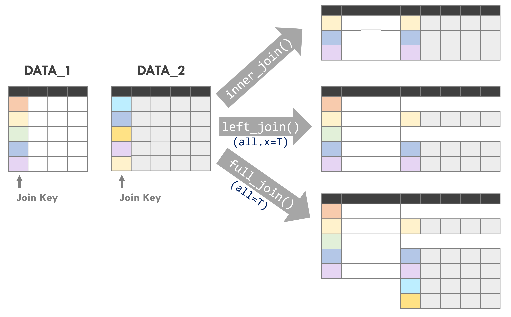
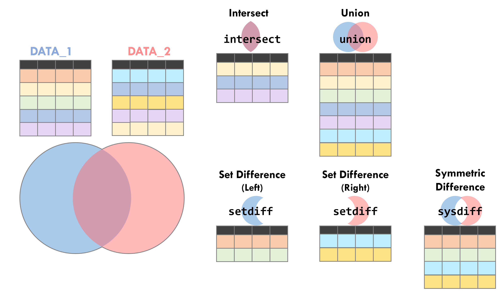
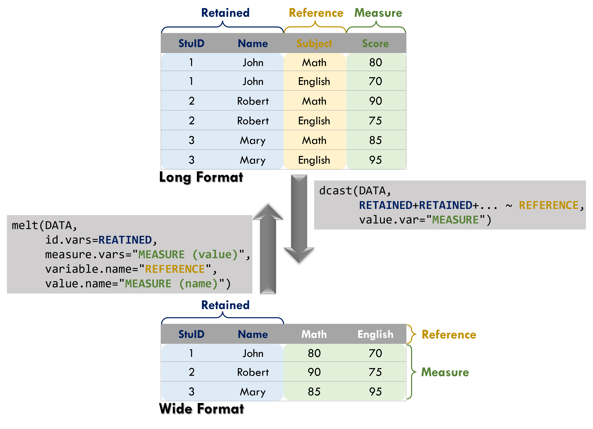

```{r setup1, include=FALSE}
knitr::opts_chunk$set(echo = TRUE)
library(dplyr)
library(data.table)
library(sf)
library(ggplot2)
library(ggsflabel)
library(ggspatial)
library(knitr)
library(kableExtra)
library(TDX)
library(DT)
library(stringr)
library(jsonlite)
library(xml2)
library(tidyr)
library(knitrhooks)
library(readxl)

Sys.setlocale(category = "LC_ALL", locale = "en")

windowsFonts(A=windowsFont("Serif"))
```


# **Data Tidy and Processing**
Data tidy and processing are essential first steps before conducting data analysis. This stage enables an initial examination of data patterns and allows descriptive analysis through tables or visualisations. After the data have been properly organised and prepared, more advanced analyses, such as building statistical models or analytical tools, can be conducted to uncover deeper insights from the data.

In R, the `dplyr`, `tidyr`, and `data.table` packages are among the most widely used tools for data manipulation. These packages should be installed and loaded before proceeding.

A summary of commonly used packages and functions for data tidy and processing is provided in Table \@ref(tab:function-data-clean). For a complete overview of the syntax and functionality of all functions introduced in this chapter, please refer to Table \@ref(tab:function-summary).

```{r function-data-clean, echo=F, eval=T}
fuc=data.frame(Package=c("`base`", rep("`dplyr`", 22), rep("`data.table`", 6), rep("`tidyr`", 2)), Functions=c("[`merge()`](#join-data)","[`bind_rows()`](#combine-data)","[`bind_cols()`](#combine-data)","[`select()`](#select-fields)","[`filter()`](#filter-data)","[`mutate()`](#append-fields)","[`group_by()`](#group-and-summarise)","[`summarise()`](#group-and-summarise)","[`reframe()`](#group-and-summarise)","[`slice()`](#group-and-summarise)","[`left_join()`](#join-data)","[`inner_join()`](#join-data)","[`full_join()`](#join-data)","[`arrange()`](#sort-data)","[`rename()`](#rename-fields)","[`distinct()`](#remove-duplicate)","[`intersect()`](#set-operations)","[`union()`](#set-operations)","[`union_all()`](#set-operations)","[`setdiff()`](#set-operations)","[`symdiff()`](#set-operations)","[`setequal()`](#set-operations)","[`case_when()`](#conditional-evaluation)","[`setDT()`](#data.frame-and-data.table)","[`setkey()`](#data.frame-and-data.table)","[`rbindlist()`](#combine-data)","[`merge.data.table()`](#join-data)","[`dcast()`](#transform-data-shape)","[`melt()`](#transform-data-shape)","[`separate()`](#split-column)","[`fill()`](#fill-data)"), Usage=c("Join two datasets based on specified columns", "Merge rows", "Merge columns", "Select specific columns", "Filter data based on conditions", "Add a new variable (column)", "Group data by specified columns", "Summarise grouped data", "Summarie grouped data", "Extract specific records by group", "Join two datasets based on specified columns (keep only left dataset)", "Join two datasets based on specified columns (keep only common observations)", "Join two datasets based on specified columns (keep all observations)", "Sort data based on specified columns", "Rename columns", "Remove duplicate records", "Find rows common to both datasets (intersection)", "Keep all rows from both datasets (union, removing duplicates)", "Keep all rows from both datasets (union, keeping duplicates)", "Find rows that exist only in the left dataset (set difference)", "Find rows that exist in only one of the datasets (symmetric difference)", "Check whether two datasets are identical (ignoring order)", "Conditional evaluation", "Convert data to `data.table` format", "Set keys for a `data.table`", "Combine all elements in a list and convert to `data.table`", "Join two datasets based on specified columns", "Transform long data into wide format", "Transform wide data into long format", "Split columns", "Fill missing values"))

colnames(fuc)=c("Package","Function","Usage")

kbl(fuc, booktabs=T, escape=F, caption="Functions of data processing")%>%
  kable_styling(bootstrap_options=c("striped", "hover"), font_size=14)%>%
  collapse_rows(1)%>%
  row_spec(0, bold=T, color="white", background="#8E8E8E")
```


To demonstrate the process of **data tidy and processing**, the dataset used in the following examples is provided below. Please read the data first.

```{r read-data-world, echo=T, eval=T}
# world country dataset
world=read.csv("https://raw.githubusercontent.com/ChiaJung-Yeh/Transport-Analysis/master/Data/world.csv")
```

```{r read-data-world-show, echo=F, eval=T, message=F, warning=F}
datatable(world, options=list(pageLength=5, scrollX=T, headerCallback = DT::JS(
    "function(thead) {",
    "  $(thead).css('font-size', '0.7em');",
    "}"
  )))%>%
  formatStyle(columns=c(1:ncol(world)), fontSize='12px')%>%
  formatRound(c("area_km2", "lifeExp","gdpPercap"), digits=2)
```

```{r read-data-coffee, echo=T, eval=T}
# coffee production dataset
coffee=read.csv("https://raw.githubusercontent.com/ChiaJung-Yeh/Transport-Analysis/master/Data/coffee.csv")
```

```{r read-data-coffee-show, echo=F, eval=T, message=F, warning=F}
datatable(coffee, options=list(pageLength=5, scrollX=T, headerCallback = DT::JS(
    "function(thead) {",
    "  $(thead).css('font-size', '0.7em');",
    "}"
  )))%>%
  formatStyle(columns=c(1:ncol(coffee)), fontSize='12px')
```

The world country dataset (`world`) records information for countries worldwide, including population (`pop`), area (`area_km2`), life expectancy (`lifeExp`), and GDP per capita (`gdpPerCap`). The coffee production dataset (`coffee`) records coffee production for countries around the world in 2016 and 2017.

## `data.frame` and `data.table`
Most functions provided by the `dplyr` and `data.table` packages offer similar functionality. However, when using functions from the `data.table` package, the dataset must first be converted to the `data.table` format in order to perform the analysis correctly. 

In addition, functions in the `data.table` package are typically more computationally efficient and therefore have clear advantages when working with large datasets. Based on empirical experience, when handling datasets with tens of millions of observations, the use of the `data.table` package is generally recommended. For smaller datasets, however, the performance difference between the two packages is usually negligible. 

For a comparison of the performance between these two data manipulation packages, please refer to the following article:

* [Comparing Efficiency and Speed of `data.table`](https://tysonbarrett.com/jekyll/update/2019/10/06/datatable_memory/)  
* [data.table speed with dplyr syntax](https://towardsdatascience.com/data-table-speed-with-dplyr-syntax-yes-we-can-51ef9aaed585)  


<p style="color:#003D79;font-size:18px;line-height:2">**⌾ Create `data.table` format dataset**</p>  

A dataset in the `data.table` format can be created directly using the `data.table()` function, whose syntax is identical to that of `data.frame()`. To convert an existing `data.frame` into the `data.table` format, the `setDT()` function can be used to assign the `data.table` structure. Using the `world` dataset as an example, the code is written as follows:

```{r read-data-world-dt, echo=T, eval=T}
# use read.csv() to read the data into data.frame
world_DT=read.csv("https://raw.githubusercontent.com/ChiaJung-Yeh/Transport-Analysis/master/Data/world.csv")

# check the data format
class(world_DT)

# setDT() function to assign the data.table format
setDT(world_DT)

# check the data format again
class(world_DT)
```


After applying the `setDT()` function, the dataset `world_DT` is additionally assigned the `data.table` format while still retaining the `data.frame` format.

Alternatively, data can be read directly using the [`fread()`](#data-import-and-export) function, which automatically returns the data in the `data.table` format. The following example use `fread()` function to the world country dataset into `data.table` format.  

```{r read-data-world-fread, echo=T, eval=F}
world_DT=fread("https://raw.githubusercontent.com/ChiaJung-Yeh/Transport-Analysis/master/Data/world.csv")
```


<p style="color:#003D79;font-size:18px;line-height:2">**⌾ Add primary key**</p>  

A **key** refers to the column(s) used to identify important attributes in a dataset. The term “key” implies that the column exhibits **unique values**, allowing it to be used to retrieve specific records without matching multiple different observations. For example, in a dataset containing students’ exam results, a student’s **ID number** or **name** may be used as a key because these attributes can uniquely identify a particular student. In contrast, exam scores are not suitable as a key because multiple students may receive the same score, meaning the value cannot uniquely identify a single record.

Based on this concept, keys are an essential component of the `data.table` data structure and contribute to the high computational efficiency of the `data.table` package. Using the `world_DT` dataset as an example, the column `name_long` (country name) can be defined as the key using the following function:

```{r data-world-dt-key, echo=T, eval=T}
# add primary key
setDT(world_DT, name_long)
```


## Combine Data

<p style="color:#003D79;font-size:18px;line-height:2">**⌾ Combine rows and columns**</p>  

In Chapter 1, we introduced the concept of **row and column binding** for data frames (see <A href="#data-frame-bind">Data Frame</A> section), including the functions `rbind()` and `cbind()`. The `dplyr` package provides similar functions, `bind_rows()` and `bind_cols()`, which serve the same purposes: the former combines datasets by **rows**, while the latter combines them by **columns**. In fact, the functionality of `bind_cols()` is identical to that of `cbind()`.

However, the `rbind()` function requires the input datasets to have **exactly the same columns**; otherwise, the datasets cannot be combined. In contrast, `bind_rows()` is more flexible, as it merges datasets based on their shared columns and fills `NA` for columns that are not present in one of the datasets. A specific example is shown below.

```{r rbind-bindrow1, echo=T, eval=T, error=T}
# create two dataset with different fields
score_data1=data.frame(Student=c("Robert", "Jessie", "Rose", "John"),
                       Class=c("A", "B", "D", "C"),
                       Score=c("80", "95", "70", "65"))

score_data2=data.frame(Student=c("Penny", "Ruby", "Tom"),
                       Score=c("90", "70", "50"))

rbind(score_data1, score_data2)
```

As shown in the example above, `score_data1` contains the column `Class`, while `score_data2` does not. As a result, the two datasets cannot be successfully combined. In this case, the `bind_rows()` function can be used instead. The code is rewritten as follows:

```{r rbind-bindrow2, echo=T, eval=T}
bind_rows(score_data1, score_data2)
```

Although `score_data2` does not contain the `Class` column, the two datasets can still be combined, with `NA` values filled in for the missing entries.

<p style="color:#003D79;font-size:18px;line-height:2">**⌾ Bind all rows in a list**</p>  

The `data.table` package also provides the `rbindlist()` function, which can combine all datasets stored in a list into a single dataset. The following example uses `rbindlist()` function to combine all data frames in the list. It should be noted that when using this function, all data frames in the list must have consistent column names.

```{r rbindlist-code, echo=T, eval=F}
# create data frames in a list
data_list=list(data.frame(Var1=c(1:5), Var2=c("A","B","C","D","E")),
               data.frame(Var1=c(6:10), Var2=c("F","G","H","I","J")))

# check the list
data_list

# bind all rows in the list
rbindlist(data_list)
```


## Select Fields
In Chapter 1, we introduced methods for selecting fields in a data frame. The `dplyr` package also provides the `select()` function for the same purpose. The function is written as follows.

```{r select-code, echo=T, eval=F}
select(DATA, VAR1, VAR2, ...)
```


<p style="color:#003D79;font-size:18px;line-height:2">**⌾ `select()`: Select fields**</p>  
Taking the selection of the `name_long` and `area_km2` columns from the `world` dataset as an example, the code is written as follows.

```{r select-eg1, echo=T, eval=T}
# select name_long and area_km2
world_sel1=select(world, name_long, area_km2)

# check the first six rows
head(world_sel1)
```


:::strong
<p style="color:#750000;">**Select fields in `data.table`**</p>  

```{r select-eg1-dt, echo=T, eval=F}
world_DT[, .(name_long, area_km2)]
```
:::

 
The following presents other approaches to select fields. Please review the <A href="#retrieve-column">Retrieve specific columns</A> in `data.frame`.

```{r select-eg2, echo=T, eval=F}
# use the column index
world[, c(1,7)]

# use the column name
world[, c("name_long", "area_km2")]

# retrieve a specific name
world$name_long
world[["area_km2"]]
```

Alternatively, the columns to be returned can be stored in a character vector and then selected using the `all_of()` function. The code is written as follows.

```{r select-eg3, echo=T, eval=T}
# create a column name vector
sel_col_name=c("name_long", "continent", "subregion")

# use all_of() function
world_sel2=select(world, all_of(sel_col_name))

# check the first six rows
head(world_sel2)
```

:::strong
<p style="color:#750000;">**Select fields using character vector in `data.table`**</p>  

```{r select-eg3-dt, echo=T, eval=F}
world_DT[, ..sel_col_name]
```
:::


<p style="color:#003D79;font-size:18px;line-height:2">**⌾ `select()`: Remove field**</p>  

To remove specific columns, place `-` before the column name to exclude it.

```{r select-eg4, echo=T, eval=T}
# remove continent, region_un, subregion, type
world_sel3=select(world, -continent, -region_un, -subregion, -type)

# check the first six rows
head(world_sel3)
```


:::strong
<p style="color:#750000;">**Remove fields in `data.table`**</p>  

```{r select-eg4-dt, echo=T, eval=F}
del_col_name=c("continent","region_un","subregion","type")
world_DT[, !..del_col_name]
```
:::


## Filter Data
Data can be filtered based on specified conditions using the `filter()` function. The function is written as follows.

```{r filter-code, echo=T, eval=F}
filter(DATA, CONDITION_1, CONDITION_2, ...)
```

In the above syntax, `CONDITION_1` and `CONDITION_2` are used to filter records that satisfy the specified criteria. The resulting dataset will include only the observations that meet **all** conditions defined within the function.

<p style="color:#003D79;font-size:18px;line-height:2">**⌾ `filter()`: Filtering numeric data**</p>  

For example, to filter countries in the `world` dataset with a population (`pop`) greater than 100 million:

```{r filter-eg1, echo=T, eval=T}
# filter the country with population over one hundred million
world_fil1=filter(world, pop>100000000)

# check the first six rows
head(world_fil1)

# see the number of rows (=number of countries met the condition)
nrow(world_fil1)
```

:::strong
<p style="color:#750000;">**Filter data by numeric data in `data.table`**</p>  

```{r filter-eg1-dt, echo=T, eval=F}
world_DT[pop>100000000]
```
:::


<p style="color:#003D79;font-size:18px;line-height:2">**⌾ `filter()`: Filtering character data**</p>  
When filtering character data, the `%in%` operator is commonly used to check whether elements of one vector exist in another vector. Please refer to the section <A href="#contain-vector">Vector</A> for checking whether each element in a vector is contained in another vector.

The follwowing example presents how to filter countries in the `world` dataset whose continent belongs to **Asia** or **Europe**.

```{r filter-eg2, echo=T, eval=T}
# filter data by population
world_fil2=filter(world, continent %in% c("Asia", "Europe"))

# check the first six rows
head(world_fil2)
```

:::strong
<p style="color:#750000;">**Filter data by character data in `data.table`**</p>  

```{r filter-eg2-dt, echo=T, eval=F}
world_DT[continent %in% c("Asia", "Europe")]
```
:::


<p style="color:#003D79;font-size:18px;line-height:2">**⌾ filter()`: Filter by multiple conditions (AND)**</p>  

All conditions specified within the `filter()` function must be satisfied for a record to be retained. Using the `world` dataset as an example, the following code filters countries that belong to **Asia** or **Europe** and have a population greater than 100 million.

```{r filter-eg3, echo=T, eval=T}
# filter the data by multiple conditions
world_fil3=filter(world, continent %in% c("Asia", "Europe"), pop>100000000)

# check the first six rows
head(world_fil3)

# see the number of rows (=number of countries met the conditions)
nrow(world_fil3)
```

In addition to separating multiple conditions with commas, all conditions can also be combined using the `&` operator. The code is rewritten as follows.

```{r filter-eg4, echo=T, eval=F}
# use & to set all the conditions
world_fil4=filter(world, continent %in% c("Asia", "Europe") & pop>100000000)
```

:::strong
<p style="color:#750000;">**Filter data by multiple conditions (AND) in `data.table`**</p>  

```{r filter-eg4-dt, echo=T, eval=F}
world_DT[continent %in% c("Asia", "Europe") & pop>100000000]
```
:::


<p style="color:#003D79;font-size:18px;line-height:2">**⌾ `filter()`: Filter by multiple conditions (OR)**</p>  

The `filter()` function returns data only when **all specified conditions are satisfied**. However, in some cases, we may want to retain observations when **any one of the conditions is met**. In such situations, the conditions can be separated using the `|` operator. The code is written as follows:

```{r filter-eg5, echo=T, eval=T}
# meet one of the condition
world_fil5=filter(world, continent %in% c("Asia", "Europe") | pop>100000000)

# see the number of rows (=number of countries met the conditions)
nrow(world_fil5)
```


:::strong
<p style="color:#750000;">**Filter data by multiple conditions (OR) in `data.table`**</p>  

```{r filter-eg5-dt, echo=T, eval=F}
world_DT[continent %in% c("Asia", "Europe") | pop>100000000]
```
:::


## Append Fields
As mentioned earlier, the [`cbind()` and `bind_cols()` functions](#combine-data) can be used to combine columns, thereby expanding the attributes of a dataset. In addition, the `$` operator introduced in <A href="#retrieve-column">Chapter 1</A> can also be used to add new variables to a dataset. 

Besides these approaches, the `mutate()` function from the `dplyr` package can be used to create new variables, providing greater flexibility in data manipulation. The syntax is as follows.

```{r mutate-code, echo=T, eval=F}
mutate(DATA, COLUMN_1=COMPUTATION_1, COLUMN_2=COMPUTATION_2, ...)
```

The `COLUMN_X` argument represents the new variable, while the `COMPUTATION_X` is the computation for each new variable.

<p style="color:#003D79;font-size:18px;line-height:2">**⌾ `mutate()`: Adding data fields**</p>  
Using the `world` dataset as an example, add a new column for **population density (`pop_dens`)** (population density is calculated as total population divided by area), and create another column that concatenates `continent` and `subregion` (using the [`paste0()`](#concatenate-strings) function to concatenate vectors). The code is written as follows.

```{r mutate-eg1, echo=T, eval=T}
# add the population density
world_mut=mutate(world, pop_dens=pop/area_km2,
                 district=paste0(continent, " (", subregion, ")"))

# check the first six rows
head(world_mut[, c("name_long", "area_km2", "pop", "pop_dens", "district")])
```


:::strong
<p style="color:#750000;">**Append fields in `data.table`**</p>  

```{r mutate-eg2, echo=T, eval=F}
# add a new field
world_mut=world_DT[, pop_dens := pop/area_km2]

# add multiple fields
world_mut=world_DT[, c("pop_dens", "district") := .(pop/area_km2, paste0(continent, " (", subregion, ")"))]
```

When adding new fields in `data.table`, the operator `:=` is used to define the assignment. The name of the new column is placed on the left-hand side, while the expression used to generate its values is specified on the right-hand side.
:::

Other approaches are shown below (please review the <A href="#data-frame-bind">Data Frame</A> section):

```{r mutate-eg3, echo=T, eval=F}
# use $ to add new field
world$pop_dens=world$pop/world$area_km2

# use [[""]] to add new field
world[["district"]]=paste0(world$continent, " (", world$subregion, ")")
```

<p style="color:#003D79;font-size:18px;line-height:2">**⌾ `mutate(_at)`: Append multiple fields with same computation**</p>  

In addition, if the same operation needs to be applied to multiple columns, either to replace the original columns or to create new ones, the `mutate_at()` function can be used. The column names to be processed must be specified within the function. The general structure of the function is shown below.

There are two ways to specify the column names. The first method (denoted as “-1” in the code below) stores the columns to be processed in a **character vector**. The second method (denoted as “-2”) specifies the columns within the `vars()` function.

It should also be noted that if only a single `function` is applied, the returned result will **directly replace the original columns**. If the original columns should be retained and new columns created instead, the function should be wrapped within `list()`. Within `list()`, the name of the new column can be defined. The new column name is constructed by combining the original column name with the new label using an underscore, following the format `originalName_newName`.

```{r mutate_at-code, echo=T, eval=F}
# Replacement-1
mutate_at(DATA, c("COLUMN_1", "COLUMN_2", ...), COMPUTATION)
# Replacement-2
mutate_at(DATA, vars(COLUMN_1, COLUMN_2, ...), COMPUTATION)

# Add new field-1
mutate_at(DATA, c("COLUMN_1", "COLUMN_2", ...), list(NEW_COLUMN_1=COMPUTATION, NEW_COLUMN_2=COMPUTATION))
# Add new field-2
mutate_at(DATA, vars(COLUMN_1, COLUMN_2, ...), list(NEW_COLUMN_1=COMPUTATION, NEW_COLUMN_2=COMPUTATION))
```

For example, if we want to compute the logarithmic values (`log()`) of the **area** and **population** in the `world` dataset, the code can be written as follows:

```{r mutate-eg4, echo=T, eval=T}
# calculate the logarithmic values of area_km2 and pop, and replace the field - 1
world_mutat1=mutate_at(world, c("area_km2", "pop"), log)

# calculate the logarithmic values of area_km2 and pop, and replace the field - 2
world_mutat1=mutate_at(world, vars(area_km2, pop), log)

# check the first six rows
head(world_mutat1[, c("name_long","area_km2","pop")])
```

Please note that in the results above, the `area_km2` and `pop` columns have been replaced by their logarithmic values, meaning the original data have been overwritten.

If instead we want to compute both the logarithmic values (`log()`) and the normalized values (`scale()`) of `area_km2` and `pop`, while retaining the original columns, the code can be written as follows:

```{r mutate-eg5, echo=T, eval=T}
# calculate the logarithmic values and scale of both area_km2 and pop, and replace the field - 1
world_mutat2=mutate_at(world, c("area_km2", "pop"), list(log=log, scale=scale))

# calculate the logarithmic values and scale of both area_km2 and pop, and replace the field - 2
world_mutat2=mutate_at(world, vars(area_km2, pop), list(log=log, scale=scale))

# check the first six rows
head(world_mutat2[, c("name_long","area_km2","pop","area_km2_log","pop_log","area_km2_scale","pop_scale")])
```


## Conditional Evaluation

<p style="color:#003D79;font-size:18px;line-height:2">**⌾ `ifelse()`: Conditional evaluation**</p>  

We have introduced the concept of **[conditional statement](#conditional-statement)**, where the `ifelse()` function can greatly simplify code. The result of such logical evaluations can also be generated using the `mutate()` function together with `ifelse()`.

Using the `world` dataset as an example, a new column is created to classify the size of a country’s area: if the country's area is greater than the **median area** of the entire dataset, it is labeled `"L"`; otherwise, it is labeled `"S"`. The code is written as follows:

```{r ifelse-eg1, echo=T, eval=T}
# calculate the median of area
area_med=median(world$area_km2)

# use ifelse() function to classify the groups
world_ifel=mutate(world, TYPE=ifelse(area_km2>=area_med, "L", "S"))

# check the first six rows
head(world_ifel[, c("name_long", "area_km2", "TYPE")])
```


<p style="color:#003D79;font-size:18px;line-height:2">**⌾ `case_when()`: Conditional evaluation with nested structure**</p>  

The `ifelse()` function is generally suitable for simple logical conditions. However, when multiple conditions are involved, nested statements may be required, which can make the code more complex. In such cases, the `case_when()` function from the `dplyr` package can be used instead. It is typically used together with the [`mutate()`](#append-fields) function to create new variables. The general structure of the `case_when()` function is shown as follows:

```{r case-when-code, echo=T, eval=F}
case_when(COLUMN, 
          CONDITION_1 ~ RETURN_1, 
          CONDITION_2 ~ RETURN_2, 
          TRUE ~ RETURN_3,
          ...)
```

Here, `TRUE` indicates the value to be returned when **none of the preceding conditions are satisfied**.

Using the `world` dataset again as an example, suppose we want to classify all countries based on their **area** and **population**, using the **median values** to distinguish between high and low levels. The countries can then be categorised into four groups: **Large Area–Large Population (LALP)**, **Large Area–Small Population (LASP)**, **Small Area–Large Population (SALP)**, and **Small Area–Small Population (SASP)**. The code is written as follows.


```{r case-when-eg1, echo=T, eval=T}
# calculate the median value of area and population
area_med=median(world$area_km2)
pop_med=median(world$pop, na.rm=T) # remove the NA in population

# use case_when() function to classify each country
world_casewhen=mutate(world, TYPE=case_when(
  area_km2>=area_med & pop>=pop_med ~ "LALP",
  area_km2>=area_med & pop<pop_med ~ "LASP",
  area_km2<area_med & pop>=pop_med ~ "SALP",
  TRUE ~ "SASP"
))

# check the first six rows
head(world_casewhen[, c("name_long", "area_km2", "pop", "TYPE")])
```


## Sort Data

<p style="color:#003D79;font-size:18px;line-height:2">**⌾ `arrange()`: Data Sorting (Ascending Order)**</p>  

We have introduced several methods for sorting data in Chapter 1, including <A href="#vector-sort">vector sorting</A> (`sort()`, `order()`, `rank()`) and [string sorting](#string-sorting) (`str_sort()`, `str_order()`). Here, we can further sort datasets using the `arrange()` function from the `dplyr` package. The general syntax is as follows.

```{r arrange-code, echo=T, eval=F}
arrange(DATA, COLUMN)
```

The `COLUMN` argument refers to the data field that needs to be sorted.

Using the `world` dataset as an example, the following code arranges all countries in ascending order of population.

```{r arrange-eg1, echo=T, eval=T}
world_arr1=arrange(world, pop)

# check the first six rows
head(world_arr1[, c("name_long", "continent", "pop")])
```

:::strong
<p style="color:#750000;">**Data sorting (ascending) in `data.table`**</p>  
<p style="color:#4D0000;">**Syntax of function:**</p>  
```{r arrange-code-dt, echo=T, eval=F}
DATA[order(COLUMN)]
```

The following code arranges all countries in ascending order of population.
```{r arrange-eg1-dt, echo=T, eval=F}
world_DT[order(pop)]
```
:::


<p style="color:#003D79;font-size:18px;line-height:2">**⌾ `arrange()`: Data Sorting (Descending Order)**</p>  

It should be noted that the `arrange()` function sorts data in **ascending order by default**. To sort in **descending order**, a `-` can be placed before the column name, or the `desc()` function can be used. Using the `world` dataset as an example, the following code arranges countries in descending order based on population.

```{r arrange-eg2, echo=T, eval=T}
world_arr2=arrange(world, -pop)

# or use desc() function to sort in descending order
world_arr2=arrange(world, desc(pop))

# check the first six rows
head(world_arr2[, c("name_long", "continent", "pop")])
```

:::strong
<p style="color:#750000;">**Data sorting (descending) in `data.table`**</p>  

```{r arrange-eg2-dt, echo=T, eval=F}
world_DT[order(-pop)]
```
:::


## Group and Summarise

<p style="color:#003D79;font-size:18px;line-height:2">**⌾ `group_by()`: Group the data by specific field**</p>  

```{r groupby-code, echo=T, eval=F}
group_by(DATA, COLUMN)
```

After applying the `group_by()` function, the dataset itself does not change; the grouping effect becomes meaningful only when it is used together with other functions.

<p style="color:#003D79;font-size:18px;line-height:2">**⌾ Filtering data by groups (`filter()`)**</p>  

By filtering grouped data, observations that meet specified conditions within each group can be selected. The general structure of the function is as follows.

```{r groupby-filter-code, echo=T, eval=F}
group_by(DATA, COLUMN)%>%
  filter(CONDITION)
```

Note that `%>%` in the function represents the **pipe operator**, which passes the result of the previous operation to the next step. This operator can be used to connect multiple functions when they operate on the same dataset.

Using the `world` dataset as an example, the data are first grouped by continent (`continent`), and then the country with the largest area within each continent is selected. The code is written as follows.

```{r groupby-filter-eg, echo=T, eval=T}
world_gro1=group_by(world, continent)%>%
  filter(area_km2==max(area_km2))

# check the first six rows
world_gro1[, c("continent","name_long","area_km2")]
```


<p style="color:#003D79;font-size:18px;line-height:2">**⌾ Add field by groups (`mutate()`)**</p>  

By adding fields based on grouped data, different operations can be applied to each group to create new attributes. Using the `world` dataset as an example, the following code calculates the [cumulative sum (`cumsum`)](#numeric-computation) of area for each continent:

```{r groupby-mutate-eg, echo=T, eval=T}
world_gro2=group_by(world, continent)%>%
  mutate(area_km2_cum=cumsum(area_km2))%>%
  arrange(continent)

# check the first six rows
head(world_gro2[, c("continent","name_long","area_km2","area_km2_cum")])
```


<p style="color:#003D79;font-size:18px;line-height:2">**⌾ Slice the data by groups (`slice()`)**</p>  

The `slice()` function returns rows based on specified index positions. When used together with `group_by()`, it can select specific rows within each group. The general structure of the function is as follows.

```{r groupby-slice-code, echo=T, eval=F}
group_by(DATA, COLUMN)%>%
  slice(INDEX)
```

For example, to return the **first observation within each group** in the `world` dataset, the code is written as follows.

```{r groupby-slice-eg1, echo=T, eval=T}
world_gro3=group_by(world, continent)%>%
  slice(1)

# check the result
world_gro3[, c("continent","name_long","area_km2","pop","lifeExp","gdpPercap")]
```

:::strong
<p style="color:#750000;">**Slice the data by groups in `data.table`**</p>  

<p style="color:#4D0000;">**Syntax of function:**</p>  
```{r groupby-slice-code-dt, echo=T, eval=F}
DATA[, .SD[INDEX], by=COLUMN]
```

The following code retrieves the first row of each continent in `world` data.
```{r groupby-slice-eg1-dt, echo=T, eval=F}
world_DT[, .SD[1], by=continent]
```
:::


In addition, multiple index positions can be specified. For example, to return the **first and last observations within each group** in the `world` dataset, the code is written as follows:

```{r groupby-slice-eg2, echo=T, eval=T}
world_gro4=group_by(world, continent)%>%
  slice(1, n())

# check the result
world_gro4[, c("continent","name_long")]
```

:::strong
<p style="color:#750000;">**Slice the data by groups in `data.table`**</p>  

The following code retrieves the first and last row of each continent in `world` data.
```{r groupby-slice-eg2-dt, echo=T, eval=F}
world_DT[, .SD[c(1, .N)], by=continent]
```

In the code above, `.N` has the same meaning as `n()` in the `dplyr` package.
:::


The `group_by() %>% slice()` functions can also be combined with `arrange()` to extract observations at specific positions after sorting. Using the `world` dataset as an example, if we want to retrieve the **three countries with the largest area in each continent**, we can first use the [`arrange()`](#sort-data) function to sort the dataset by area (`area_km2`). Then, `group_by() %>% slice()` can be used to select the required index positions (i.e., `1:3`). The code is written as follows.

```{r groupby-slice-eg3, echo=T, eval=T}
world_gro5=arrange(world, desc(area_km2))%>%
  group_by(continent)%>%
  slice(1:3)

# check the result
world_gro5[, c("continent","name_long","area_km2","pop","lifeExp","gdpPercap")]
```


:::strong
<p style="color:#750000;">**Arrange and slice the data by groups in `data.table`**</p>  

The following code retrieves the first three largest countries for each continent in `world` data.
```{r groupby-slice-eg3-dt, echo=T, eval=F}
world_DT[order(-area_km2)]%>%
  .[, .SD[c(1:3)], by=continent]
```

Similar to the syntax used in the `dplyr` package, different functions can be chained together using the pipe operator (`%>%`). 

It should also be noted that the returned result retains both matched and unmatched observations. For example, in the `world_DT` dataset, **Antarctica** contains only one region. Since we attempt to retrieve the top three records, the function still returns three rows; the unmatched entries are filled with `NA`.
:::


The `group_by() %>% filter()` approach cannot be used to return observations that satisfy **multiple different conditions simultaneously** within groups. In practice, however, we may extract records that meet several distinct criteria. In such cases, the desired result can be obtained using `group_by() %>% slice()`.

Using the `world` dataset as an example, the data are first grouped by continent (`continent`), and then the countries with the **largest** and **smallest** area within each continent are selected. The code is written as follows:

```{r groupby-slice-eg4, echo=T, eval=T}
world_gro6=group_by(world, continent)%>%
  slice(which.max(area_km2),
        which.min(area_km2))

# check the result
world_gro6[, c("continent","name_long","area_km2")]
```

In the code above, the `which.max()` function is used to identify the index of the maximum value, while `which.min()` identifies the index of the minimum value. By using `group_by() %>% slice()`, observations that satisfy different specific conditions can be returned simultaneously. In summary, the `group_by() %>% slice()` approach provides considerable flexibility when selecting records within groups.


:::strong
<p style="color:#750000;">**Slice the data by groups in `data.table`**</p>  

The following code retrieves the largest and smallest countries for each continent in `world` data.
```{r groupby-slice-eg4-dt, echo=T, eval=F}
world_DT[, .SD[c(which.min(area_km2), which.max(area_km2))], by=continent]
```
:::


<p style="color:#003D79;font-size:18px;line-height:2">**⌾ Summarise the data by groups (`summarise()`)**</p>  

Grouped data can be summarised by applying operations to variables within each group, such as calculating the **maximum**, **minimum**, **sum**, or **mean**, or by using custom functions. The general structure for performing grouped summaries is shown below.

```{r groupby-summarise-code, echo=T, eval=F}
group_by(DATA, COLUMN)%>%
  summarise(COMPUTATION)
```

Using the `world` dataset as an example, the data are first grouped by continent (`continent`), and then the **total population** and **number of countries** within each continent are calculated. The code is written as follows.

```{r groupby-summarise-eg1, echo=T, eval=T}
world_gro7=group_by(world, continent)%>%
  summarise(pop=sum(pop, na.rm=T),
            County_N=n())

# check the result
world_gro7
```

Note that in this example the `pop` (total population) column contains some `NA` values. To avoid incorrect results during calculation, the argument `na.rm = T` must be specified in the `sum()` function. In addition, unlike `group_by() %>% filter()`, which returns **all columns of the dataset**, the `group_by() %>% summarise()` function returns **only the specified summary columns**.

Finally, the `n()` function is used to calculate the **total number of observations within each group**.

:::strong
<p style="color:#750000;">**Summarise the data by groups in `data.table`**</p>  

<p style="color:#4D0000;">**Syntax of function:**</p>  
```{r groupby-summarise-code-dt, echo=T, eval=F}
DATA[, .(COMPUTATION), by=COLUMN]
```

The following code computes the total population and number of countries for each continent.
```{r groupby-summarise-eg-dt, echo=T, eval=F}
world_DT[, .(pop=sum(pop, na.rm=T), County_N=.N), by=continent]
```
:::


If the same operation needs to be applied to multiple variables, the `summarise_at()` function can be used by specifying multiple column names. For example, to calculate the **average life expectancy** and **average GDP per capita** for each continent in the `world` dataset, the code is written as follows:

```{r groupby-summarise-eg2, echo=T, eval=T, warning=F}
world_gro8=group_by(world, continent)%>%
  summarise_at(c("lifeExp", "gdpPercap"), mean, na.rm=T)

# check the result
world_gro8
```

In addition, when a large number of variables need to be selected and listing them individually is impractical, the `across()` function can be used to specify a range of variables. The `across()` function is placed within the `summarise()` function, where both the range of variable names and the operation to be applied must be specified. The general structure of the function is shown as follows.

```{r groupby-summarise-across-code, echo=T, eval=F}
group_by(DATA, COLUMN)%>%
  summarise(across(COLUMN_1:COLUMN_2, ~ COMPUTATION(.x)))
```

For example, computing the average values from data field area to lifeExp in the `world` dataset is shown below.

```{r groupby-summarise-eg3, echo=T, eval=T, warning=F}
world_gro9=group_by(world, continent)%>%
  summarise(across(area_km2:lifeExp, ~ mean(.x, na.rm=T)))

# check the result
world_gro9
```

If operations need to be applied to all variables that satisfy a specified condition, the `summarise_if()` function can be used. This function first identifies all columns that meet the given condition and then applies the specified operation to them. For example, to calculate the **mean of all numeric variables** in the `world` dataset (using the `is.numeric()` function to check whether a column is numeric), the code is written as follows.

```{r groupby-summarise-eg4, echo=T, eval=T, warning=F}
world_gro10=group_by(world, continent)%>%
  summarise_if(is.numeric, mean, na.rm=T)

# check the result
world_gro10
```


<p style="color:#003D79;font-size:18px;line-height:2">**⌾ Reframe the data by groups (`reframe()`)**</p>  

In addition to `group_by() %>% summarise()`, the same objective can also be achieved using `group_by() %>% reframe()`, which offers greater flexibility. In the previous examples, `group_by() %>% summarise()` returns aggregated results, where the `function` typically produces a **single value** for each group. For instance, `sum()` calculates the total of a specified variable within each group.

However, in some cases the `function` may return **multiple values**. For example, the `range()` function returns two values: the **minimum** and **maximum**. When using `group_by() %>% summarise()` in such situations, results can still be produced, but a warning message may appear. In contrast, `group_by() %>% reframe()` can return the correct results **without warnings**.

The general structure of `group_by() %>% reframe()` is shown below, which is similar to that of `group_by() %>% summarise()`:

```{r groupby-reframe-code, echo=T, eval=F}
group_by(DATA, COLUMN)%>%
  reframe(COMPUTATION)
```

Using the `world` dataset again as an example, the data are first grouped by continent (`continent`), and then the range of GDP per capita (`gdpPercap`) for each continent is calculated. The code is written as follows.

```{r groupby-reframe-eg, echo=T, eval=T, warning=F}
world_gro11=group_by(world, continent)%>%
  reframe(gdpPercap=range(gdpPercap, na.rm=T))

# check the result
world_gro11
```

From the results above, the range of GDP per capita for each continent can be observed. It should also be noted that because all countries in **Antarctica** have no GDP per capita data, the returned lower and upper bounds are `Inf` and `-Inf`, respectively.

:::strong
<p style="color:#750000;">**Summarise the data by groups in `data.table`**</p>  

The following code retrieves the range of GDP per capita in each continent.
```{r groupby-reframe-eg-dt, echo=T, eval=F}
world_DT[, .(pop=range(gdpPercap, na.rm=T)), by=continent]
```
:::


## Join Data
[`cbind()` and `bind_cols()`](#combine-data) functions directly combine two datasets that have the same number of rows, linking them together side by side. However, in data analysis we often deal with datasets that come from different sources and serve different purposes. If we want to combine them, we must attach them based on **join keys**.

More specifically, the `world` dataset records detailed information about countries around the world, while the `coffee` dataset records coffee production for countries worldwide. If we want to know both the land area and coffee production of each country at the same time, we need to merge these two datasets. The principle of merging is to attach the data based on the **country name** as the join key.

In the `dplyr` package, this can be done using `join`-related functions, including <A href="#left-join">`left_join()`</A>, <A href="#full-join">`full_join()`</A>, and <A href="#inner-join">`inner_join()`</A>.

* `left_join()` keeps **all observations from the first (left) dataset**, and brings the data from the second (right) dataset based on the join key.    
* `full_join()` keeps **all observations from both datasets**, and attaches them to each other based on the join key.  
* `inner_join()` keeps only the observations whose the value of join keys are **shared by both datasets**, and attaches them accordingly.

In the `base` package and the `data.table` package, regardless of the type of data joining required, the task can be achieved using the `merge()` and `merge.data.table()` functions respectively. The joining method can be determined by setting the arguments (`all=` and `all.x=`).

For a conceptual illustration of data joining, see the diagram in Figure \@ref(fig:join-fig). A summary of the functions for joining data in the three packages above is presented in Table \@ref(tab:join-table).


```{r join-fig, echo=F, eval=T, out.width="80%", fig.align="center", fig.cap="Illustration of joining data"}

```

```{r join-table, echo=F, eval=T}
join_table=data.frame(method=c("<A href='#left-join'>keep all observations from the first (left) dataset</A>","<A href='#full-join'> keep all observations from both datasets</A>","<A href='#inner-join'>keep only the observations with join key shared by both datasets</A>"),
                      func_dplyr=c("`left_join(DATA_1, DATA_2)`","`full_join(DATA_1, DATA_2)`","`inner_join(DATA_1, DATA_2)`"),
                      func_base=c("`merge(DATA_1, DATA_2, all.x=T)`","`merge(DATA_1, DATA_2, all=T)`","`merge(DATA_1, DATA_2)`"),
                      func_datatable=c("`merge.data.table(DATA_1, DATA_2, all.x=T)`","`merge.data.table(DATA_1, DATA_2, all=T)`","`merge.data.table(DATA_1, DATA_2)`"))

kbl(join_table, booktabs=T, escape=F, caption="Summary of join methods", col.names=c("Join Method","`dplyr` Pacakage","`base` Pacakage","`data.table` Package"))%>%
  kable_styling(bootstrap_options=c("striped", "hover"), font_size=14)%>%
  row_spec(0, bold=T, color="black", background="#8E8E8E")%>%
  column_spec(1, bold=T, color="white", background="#D0D0D0")
```


<H2 id="left-join"><p style="color:#003D79;font-size:18px;line-height:2">**⌾ Keep all observations from the first (left) dataset**</p></H2>  

The `left_join()` function is structured as below.  

```{r leftjoin-code, echo=T, eval=F}
left_join(DATA_1, DATA_2, by="KEY")
```

The `by=` argument in the function is used to specify the **join key** (`KEY`). In other words, when the values in the join keys are the same in both datasets, the columns from `DATA_1` will be attached to `DATA_2`.

The `left_join()` function keeps **all observations in `DATA_1`**. Therefore, if a value in the join key of `DATA_1` cannot find a corresponding match in `DATA_2`, the attached result for that row will return **`NA`**.

It is also important to note that the `by=` argument is not mandatory. If it is omitted, the function will **automatically search for columns with the same names in both datasets and use them as the join keys**. If the reference columns in the two datasets have **different column names**, the argument should be specified as `by=c(DATA_1_REFERENCE=DATA_2_REFERENCE)`. If there are **multiple reference columns**, the column names should be expressed as a vector, for example: `by=c("REFERENCE_1", "REFERENCE_2")`. It is strongly recommended to explicitly specify the join key to avoid ambiguity and incorrect results.

Using student information (`StuInfo`) and student score records (`StuScore`) as an example, the code can be written as follows.

```{r leftjoin-eg1, echo=T, eval=T}
# create student and grade data
StuInfo=data.frame(StudentID=c("ID1","ID2","ID3","ID4","ID5","ID6"),
                   Class=c("A","B","A","C","D","A"),
                   Name=c("Bob","Mary","Robert","Jason","Jane","Jessie"))
StuScore=data.frame(StudentID=c("ID1","ID2","ID4","ID5","ID6","ID7"),
                    Score=c(60,80,40,50,100,90))

# left join both datasets
left_join(StuInfo, StuScore, by="StudentID")
```

In the above code, `by="StudentID"` specifies the join key shared by the two datasets. Since the reference columns in both datasets have the same name, this argument could also be omitted. Since student code **“ID7”** does not exist in Dataset 1 (`StuInfo`), the corresponding attributes from Dataset 2 (`StuScore`) are returned as `NA`.

:::strong
<p style="color:#750000;">**Joining data in the `base` and `data.table` packages**</p>  
In these two packages, if the joining method is **based on the first (left) dataset**, the argument **`all.x=TRUE`** must be specified. The `by=` argument in the function is used to define the **join key**. If the names of join key differ between the two datasets, the arguments `by.x=` and `by.y=` must be specified to indicate their names in the both datasets. The general structure of the function is as follows:

```{r merge1-code-dt, echo=T, eval=F}
# if the name of join keys are identical
merge(DATA_1, DATA_2, all.x=T, by="KEY")
merge.data.table(DATA_1, DATA_2, all.x=T, by="KEY")

# if the name of join keys are different
merge(DATA_1, DATA_2, all.x=T, by.x="KEY_DATA_1", by.y="KEY_DATA_2")
merge.data.table(DATA_1, DATA_2, all.x=T, by.x="KEY_DATA_1", by.y="KEY_DATA_2")
```

Using the student score data for example, the left join can be implemented as follows.
```{r merge-eg1-dt, echo=T, eval=F}
StuInfo_DT=data.table(StudentID=c("ID1","ID2","ID3","ID4","ID5","ID6"),
                      Class=c("A","B","A","C","D","A"),
                      Name=c("Bob","Mary","Robert","Jason","Jane","Jessie"))
StuScore_DT=data.table(StudentID=c("ID1","ID2","ID4","ID5","ID6","ID7"),
                       Score=c(60,80,40,50,100,90))

# base Package
merge(StuInfo, StuScore, all.x=T, by="StudentID")

# data.table Package
merge.data.table(StuInfo_DT, StuScore_DT, all.x=T, by="StudentID")
```
:::


Using the previously introduced `world` and `coffee` datasets as an example, the data are joined based on country names, with each country’s coffee production attached to the `world` dataset. The code is written as follows.

```{r leftjoin-eg2, echo=T, eval=T}
# left join two datasets based on the join key name_long
world_coffee=left_join(world, coffee, by="name_long")

# sort the coffee production in 2017 in descending order 
world_coffee=arrange(world_coffee, desc(coffee_production_2017))

# check the first six rows
head(world_coffee[, c("name_long","continent","coffee_production_2016","coffee_production_2017")])
```

Note that in this example, the country name column in the `world` dataset and the corresponding column in the `coffee` dataset share the same name, **`name_long`**. Therefore, even if the `by=` argument is not specified, the same result will still be obtained.


<H2 id="full-join"><p style="color:#003D79;font-size:18px;line-height:2">**⌾ Keep all observations from both datasets**</p></H2>  

The function structure of `full_join()` is similar to that of the previously introduced <A href='#left-join'>`left_join()`</A> function.

Using `StuInfo` and `StuScore` as examples again, the result obtained using `full_join()` is shown below.

```{r fulljoin-eg, echo=T, eval=T}
full_join(StuInfo, StuScore, by="StudentID")
```

From the results above, we can observe that all **“StudentID”** values from both datasets are retained. If a record cannot be matched, the corresponding fields are displayed as `NA`. For example, **“ID3”** has no record in `StuScore`, while **“ID7”** has no record in `StuInfo`. Therefore, after the join, the unmatched attributes in the other dataset are shown as `NA`.


:::strong
<p style="color:#750000;">**Joining data (full) in the `base` and `data.table` packages**</p>  
If the joining method is to **keep all observations from both datasets**, the argument **`all=TRUE`** must be specified. The configuration of the other arguments is the same as previously described. The general structure of the function is as follows:

```{r merge2-code-dt, echo=T, eval=F}
merge(DATA_1, DATA_2, all=T, by="KEY")
merge.data.table(DATA_1, DATA_2, all=T, by="KEY")
```

Using the two dataset `StuInfo`, `StuScore` for full join, for example.
```{r merge-eg2-dt, echo=T, eval=F}
# base Package
merge(StuInfo, StuScore, all=T, by="StudentID")

# data.table Package
merge.data.table(StuInfo_DT, StuScore_DT, all=T, by="StudentID")
```
:::


<H2 id="inner-join"><p style="color:#003D79;font-size:18px;line-height:2">**⌾ Keep only the observations with join key shared by both datasets**</p></H2>  
The function structure of `inner_join()` is similar to that of the previously introduced <A href='#left-join'>`left_join()`</A> function.

Using the two dataset `StuInfo`, `StuScore` again for inner join, for example. The join key is `StudentID`.。

```{r innerjoin-eg, echo=T, eval=T}
inner_join(StuInfo, StuScore, by="StudentID")
```

From the results above, we can observe that only the **“StudentID”** values shared by both datasets are retained, while unmatched records are removed. For example, **“ID3”** has no record in `StuScore`, and **“ID7”** has no record in `StuInfo`. Therefore, after the join, these two records are excluded from the result.

:::strong
<p style="color:#750000;">**Joining data (inner) in the `base` and `data.table` packages**</p>  
If the joining method is to **keep only the observations with join key shared by both datasets**, the arguments `all=` and `all.x=` **do not need to be specified**. The general structure of the function is as follows:

```{r merge3-code-dt, echo=T, eval=F}
merge(DATA_1, DATA_2, by="KEY")
merge.data.table(DATA_1, DATA_2, by="KEY")
```

Using the two dataset `StuInfo`, `StuScore` again for inner join.  
```{r merge-eg3-dt, echo=T, eval=F}
# base Package
merge(StuInfo, StuScore, by="StudentID")

# data.table Package
merge.data.table(StuInfo_DT, StuScore_DT, by="StudentID")
```
:::


## Rename Fields
In chapter 1, methods for assigning column names to a dataset were introduced, such as using `colnames()` to set or modify column names. In addition, the `rename()` function in the `dplyr` package can also be used to assign new field names by specifying columns. The general structure of the function is as follows.

```{r rename-code, echo=T, eval=F}
rename(DATA, NEW_NAME=OLD_NAME)
```

Using the `StuScore` dataset as an example, the following code demonstrates how to rename its columns.

```{r rename-eg1, echo=T, eval=T}
StuInfo_rn1=rename(StuInfo, STUID=StudentID, CLASS=Class)

StuInfo_rn1
```

In addition, the `rename_with()` function can be used to provide greater flexibility when modifying column names. The general structure of the function is as follows.

```{r rename-with-code, echo=T, eval=F}
rename_with(DATA, FUNCTION)
```

Using the `StuScore` dataset again as an example, if we want to convert all column names to [uppercase letters](#convert-case), the code can be written as follows.

```{r rename-eg2, echo=T, eval=T}
StuInfo_rn2=rename_with(StuInfo, toupper)

StuInfo_rn2
```


In addition to using existing functions, column names can also be modified by defining a [custom function](#custom-functions). For example, if we want to append “_A” to all column names, the code can be written as follows.

```{r rename-eg3, echo=T, eval=T}
# define custom functions
paste_A=function(x){
  return(paste0(x, "_A"))
}

# revise the column name by appending "_A"
StuInfo_rn3=rename_with(StuInfo, paste_A)

StuInfo_rn3
```


If conditional modification of column names is required, the `.cols=` argument can be used to specify the column indices that need to be changed. Using the `StuInfo` dataset as an example, if we want to convert column names containing the letter **“a”** to uppercase, the code can be written as follows.

```{r rename-eg4, echo=T, eval=T}
StuInfo_rn4=rename_with(StuInfo, toupper, .cols=grep("a", colnames(StuInfo)))

StuInfo_rn4
```

In the above code, the [`colnames()`](#data-frame) function is used to return the column names of a dataset, while the [`grep()`](#search-characters) function searches for the index values of elements containing a specific character.


## Remove Duplicate
We have introduced the `unique()` function in Chapter 1, which can be used to extract the unique values of a vector by removing duplicated elements. If we want to remove duplicated **rows** from a dataset, the `distinct()` function can be used. Its general structure is as follows.

```{r distinct-code, echo=T, eval=F}
distinct(DATA)
```


The following example demonstrates the functionality of the `distinct()` function. The <A href="#duplicated-rows">`duplicated`</A> function is also used beforehand to check whether there are duplicated rows.

```{r distinct-eg, echo=T, eval=T}
# create data with duplicated rows
StuScore_dup=data.frame(StudentID=c("ID1","ID2","ID4","ID3","ID4","ID5","ID2"),
                        Name=c("Bob","Mary","Jason","Robert","Jason","Jane","Mary"),
                        Score=c(60,80,40,100,40,100,80))

# check if duplicated row exists
duplicated(StuScore_dup)

# remove duplicates
distinct(StuScore_dup)
```

:::strong
<p style="color:#750000;">**Remove duplicates in `base` package**</p>  
The `unique()` function can not only remove duplicated elements within a vector, but can also be used to remove duplicated rows in a data frame. Note that `unique()` function can also be applied to `data.table` format, which may be more efficienct in removing duplicates.  

```{r unique-eg-dt, echo=T, eval=F}
unique(StuScore_dup)
```
:::


## Set Operations
Set operations include **intersect**, **union**, **difference** and **symmetric difference**, as illustrated in Figure \@ref(fig:set-operations-fig).

```{r set-operations-fig, echo=F, eval=T, out.width="80%", fig.align="center", fig.cap="資料集合示意圖"}

```

<p style="color:#003D79;font-size:18px;line-height:2">**⌾ Intersect**</p>
The **intersect** of datasets can be obtained using the `intersect()` function. The general structure of the function is as follows. The columns of `DATA_1` and `DATA_2` must be identical.

```{r intersect-code, echo=T, eval=F}
intersect(DATA_1, DATA_2)
```

Using the newly created datasets `data1` and `data2` as examples, the code can be written as follows.

```{r intersect-eg, echo=T, eval=T}
# create data
data1=data.frame(Var1=c("A","B","C","D","E"), Var2=c(1,2,3,4,5), Var3=c(T,F,T,F,T))
data2=data.frame(Var1=c("F","D","G","E","B"), Var2=c(6,4,7,5,2), Var3=c(F,F,T,T,F))

# intersect
intersect(data1, data2)
```

:::strong
<p style="color:#750000;">**Intersect in `data.table` package**</p>  
```{r intersect-eg-dt, echo=T, eval=F}
data1_DT=data.table(Var1=c("A","B","C","D","E"), Var2=c(1,2,3,4,5), Var3=c(T,F,T,F,T))
data2_DT=data.table(Var1=c("F","D","G","E","B"), Var2=c(6,4,7,5,2), Var3=c(F,F,T,T,F))

fintersect(data1_DT, data2_DT)
```
:::


<p style="color:#003D79;font-size:18px;line-height:2">**⌾ Union**</p>
The **union** of datasets can be obtained using the `union()` function. The general structure of the function is as follows. The columns of `DATA_1` and `DATA_2` must be identical. It should also be noted that if duplicated records exist in the datasets, the `union()` function will automatically remove them. If all duplicated records are to be retained, the `union_all()` function can be used instead.

```{r union-code, echo=T, eval=F}
# Union (remove duplicated data)
union(DATA_1, DATA_2)

# Union（retain duplicated data）
union_all(DATA_1, DATA_2)
```

Taking the union of `data1` and `data2` for examples, the code can be written as follows.
```{r union-eg, echo=T, eval=T}
# union
union(data1, data2)
```

:::strong
<p style="color:#750000;">**Union in `data.table` package**</p>  
```{r union-eg-dt, echo=T, eval=F}
funion(data1_DT, data2_DT)
```
:::


<p style="color:#003D79;font-size:18px;line-height:2">**⌾ 差集**</p>
The **difference** between datasets can be obtained using the `setdiff()` function. The general structure of the function is as follows. The columns of `DATA_1` and `DATA_2` must be identical.

```{r setdiff-code, echo=T, eval=F}
setdiff(DATA_1, DATA_2)
```

Taking the set difference of `data1` and `data2` for examples, the code can be written as follows.
```{r setdiff-eg, echo=T, eval=T}
# difference (data1-data2)
setdiff(data1, data2)

# difference (data2-data1)
setdiff(data2, data1)
```

:::strong
<p style="color:#750000;">**Difference in `data.table` pacakge**</p>  
```{r setdiff-eg-dt, echo=T, eval=F}
fsetdiff(data1_DT, data2_DT)
```
:::


<p style="color:#003D79;font-size:18px;line-height:2">**⌾ Symmetric difference**</p>
The **symmetric difference** between datasets can be obtained using the `setdiff()` function. The general structure of the function is as follows. The columns of `DATA_1` and `DATA_2` must be identical.

```{r symdiff-code, echo=T, eval=F}
symdiff(DATA_1, DATA_2)
```

Taking the symmetric difference of `data1` and `data2` for examples, the code can be written as follows.
```{r symdiff-eg, echo=T, eval=T}
# symmetric difference
symdiff(data1, data2)
```


<p style="color:#003D79;font-size:18px;line-height:2">**⌾ Checking whether two datasets are identical**</p>
If we want to check whether two datasets are exactly the same, the `setequal()` function can be used. The general structure of the function is as follows.  
```{r setequal-code, echo=T, eval=F}
setequal(DATA_1, DATA_2)
```

The following code checks whether the two datasets are identical.  
```{r setequal-eg, echo=T, eval=T}
# check identical datasets
setequal(data1, data2)
```

:::strong
<p style="color:#750000;">**Check identical datasets in `data.table` pacakge**</p>  
```{r setequal-eg-dt, echo=T, eval=F}
fsetequal(data1_DT, data2_DT)
```
:::


## Transform Data Shape
Based on the length and width of a dataset, it can be broadly classified into **long data** and **wide data** formats. **Long data** refers to a format in which different attributes are **listed row by row**. This format typically contains a larger number of observations and often includes many repeated rows. In contrast, **wide data** refers to a format in which different attributes are **spread across columns**. This format usually contains fewer observations but more fields.

As illustrated in Figure \@ref(fig:melt-dcast-fig), if we want to record students’ scores for different subjects, there are two possible recording methods. One is the **long data** format, where student, subject, and score are recorded in separate columns. The other is the **wide data** format, where subject-specific columns (such as “Math” and “English” in the figure) are created and the corresponding scores are recorded in each column.

```{r melt-dcast-fig, echo=F, eval=T, out.width="85%", fig.align="center", fig.cap="Illustration of long and wide format"}

```

Both long and wide data formats have different application scenarios. For example, when performing statistical analysis, the **long format** is advantageous because it facilitates grouping and summarising data using functions such as [`group_by() %>% summarise()`](#group-and-summarise). On the other hand, the **wide format** is more convenient for presenting and inspecting numerical results in tabular outputs.

In addition, in the transport field, **discrete choice models** are often used to analyse the selection behavior of transport modes, routes, or alternatives. In R, commonly used packages for discrete choice modeling include [`mlogit`](https://cran.r-project.org/web/packages/mlogit/mlogit.pdf) and [`apollo`](https://www.apollochoicemodelling.com/). Both packages allow users to specify either wide or long data formats within their functions, enabling flexible data input depending on the dataset structure.

<p style="color:#003D79;font-size:18px;line-height:2">**⌾ Long format to wide format**</p>
Long data can be converted into wide data using the `dcast()` function in the `reshape2` or `data.table` package. Its general structure is as follows. Please note that two packages use the same function name; however, the output result might be different in some cases. `reshape2` package is most suitable for `data.frame`, while `data.table` package is desinged for `data.table` format. Therefore, it is recommended to specify the package name (e.g., `reshape2::dcast()``) when using the functions based on the input data format.


```{r dcast-code, echo=T, eval=F}
dcast(DATA, RETAINED_COLUMN_1+RETAINED_COLUMN_2+... ~ REERENCE_COLUMN, value.var="MEASURE_COLUMN")
```

Please refer to Figure \@ref(fig:melt-dcast-fig) for the explanation of each type of **columns**.

A **retained column** refers to a column that remains unchanged after the transformation. Using the student score data in Figure \@ref(fig:melt-dcast-fig) as an example, the student ID (`StuID`) and name (`Name`) remain fixed after the transformation.

A **reference column** is the basis for the varying columns and will be expanded into the header. For example, **subject** (`Subject`) serves as the reference column; after converting the data to wide format, the values in this column are added to the header as new column names.

A **value column** refers to the column whose values are filled into the wide-format table according to the **reference column**. For example, **score** (`Score`) is the value column, and the value of scores are filled into the corresponding reference columns based on the subject names.

A concrete example is illustrated using the student score data shown in Figure \@ref(fig:melt-dcast-fig). The code is written as follows.

```{r dcast-eg, echo=T, eval=T, warning=F}
# create data in long format 
StuScore=data.frame(StuID=rep(1:3, each=2),
                    Name=rep(c("John", "Robert", "Mary"), each=2),
                    Subject=rep(c("Math", "English"), times=3),
                    Score=c(80,70,90,75,85,95))

# check the data
StuScore

# convert long format to wider format
StuScore_wide=reshape2::dcast(StuScore, StuID+Name ~ Subject, value.var="Score")

# check the result
StuScore_wide
```


<p style="color:#003D79;font-size:18px;line-height:2">**⌾ Wide format to long format**</p>

Wide data can be converted into long data using the `melt()` function. Its general structure is as follows. Please refer to Figure \@ref(fig:melt-dcast-fig) and the previous explanation of each type of **column**.

```{r melt-code, echo=T, eval=F}
melt(DATA, id.vars=c("RETAINED_COLUMN", ...),
     measure.vars="MEASURE_COLUMN",
     variable.name="REFERENCE_COLUMN",
     value.name="MEASURE_COLUMN_NAME")
```

Using the student score data as an example again, the wide-format dataset `StuScore_wide`, which was previously created using the `dcast()` function, can be converted back into long format using the `melt()` function. The code is written as follows.

```{r melt-eg, echo=T, eval=T, warning=F}
# covert wide format to long format
StuScore_long=reshape2::melt(StuScore_wide, id.vars=c("StuID", "Name"),
                             measure.vars=c("Math","English"), variable.name="Subject", value.name="Score")

# check the first six rows
StuScore_long
```

Using the `coffee` dataset as an example, it is in **wide format**, where coffee production is recorded in separate columns (e.g., `coffee_production_2016`, `coffee_production_2017`). If we want to convert it into **long format**, all production values can be placed in a single column, with an additional column added to record the **year (`Year`)**. The code can be written as follows.

```{r melt-eg-coffee1, echo=T, eval=T, warning=F}
# covert wide format to long format
coffee_long=reshape2::melt(coffee, id.vars=c("name_long"),
                           measure.vars=c("coffee_production_2016","coffee_production_2017"),
                           variable.name="Year", value.name="Production")%>%
  arrange(name_long)

# check the first six rows
head(coffee_long)
```

After converting to long format, the **Year** column records the original column names (`coffee_production_2016` and `coffee_production_2017`). If we want to keep only the year values (2016, 2017), we can use the text replacement function [`gsub()`](#extract-and-replace-characters) to replace the string `"coffee_production_"` with an empty string (`""`). The result can then be converted to a numeric type using the `as.numeric()` function. The code is written as follows.

```{r melt-eg-coffee2, echo=T, eval=T, warning=F}
# replace the characters using gsub()
coffee_long$Year=as.numeric(gsub("coffee_production_", "", coffee_long$Year))

# check the first six rows
head(coffee_long)
```

## Split Column
Sometimes a single column may contain multiple attributes combined into one string and separated by a delimiter. For subsequent data analysis, it may be necessary to split these attributes into separate columns. In such cases, the [`str_split()`](#split-strings) function can be used to first split the string. The result can then be converted into a `data.frame`, and finally merged with the original dataset using the [`cbind()`](#combine-data) function to complete the column separation.

Using the student score dataset (`StuScore_split`) as an example, the **Student** column records both the student ID and name, separated by the symbol “-”. If we want to split this column and create two separate columns, the code can be written as follows.

```{r separate-eg1, echo=T, eval=T}
# create data
StuScore_split=data.frame(Student=c("1-John","2-Robert","3-Mary"), Score=c(80,70,90))

# split the Student field and store in a data frame
stu_split=strsplit(StuScore_split$Student, "-")
stu_split=data.frame(matrix(unlist(stu_split), ncol=2, byrow=T))
colnames(stu_split)=c("StuID", "Name")

# bind all data and delete the original column
cbind(stu_split, StuScore_split)%>%
  select(-Student)
```

The approach above is relatively verbose. The `separate()` function provided in the `tidyr` package can handle such situations more efficiently. The general structure of the function is as follows.

```{r separate-code, echo=T, eval=F}
separate(DATA, col=SPLIT_COLUMN, into=NEW_COLUMN_NAME, sep="SEPARATION")
```

If the split operation produces **n** components, the `into=` argument must be specified as a vector containing **n elements**; otherwise, only part of the result will be returned. The `sep=` argument is used to define the **delimiter** within the column to be split.

```{r separate-eg2, echo=T, eval=T}
separate(StuScore_split, col="Student", into=c("StuID","Name"), sep="-")
```

As shown in the example above, using the `separate()` function to split data columns is straightforward and can significantly improve the conciseness of the code.

## Fill Data
In practical datasets, some values are often missing and need to be filled before further statistical analysis or data processing can be performed. If we want to fill missing values using the observations above or below them, the `fill()` function can be used. The general structure of the function is as follows.

```{r fill-code, echo=T, eval=F}
fill(DATA, FILL_COLUMN, .direction="DIRECTION")
```

The `.direction=` argument specifies the **direction of filling**, which can be set to one of four options: upward (`up`), downward (`down`), first upward then downward (`updown`), or first downward then upward (`downup`).

Using the bus performance data from New South Wales as an example, first download and read the Excel file. The original dataset contains `NA` values in the Region and Year fields. This commonly occurs when importing XLSX files into R because Excel files may contain merged cells. When such files are read into R, the values in merged cells are typically recorded only in the first row, while the remaining rows are interpreted as empty and therefore appear as `NA`.

```{r fill-eg, echo=T, eval=T}
bus_performance=read_excel("Data/nsw_busperformance_reports.xlsx", sheet="BusData")

# check the first 10 rows
bus_performance[1:10,]

# fill the "Region" and "Year" downward
bus_performance=fill(bus_performance, c("Region", "Year"), .direction="down")

# check the first 10 rows again
bus_performance[1:10,]
```

After filling these two fields, the complete dataset can be used for further analysis.


## **Summary of Data Tidy and Processing Functions** {-}

The colours of the function names indicate the package to which each function belongs.  

* <p style="background-color:#FFECEC;">`base`</p>  
* <p style="background-color:#ECF5FF;">`dplyr`</p>  
* <p style="background-color:#F5FFE8;">`data.table` (when using this package, the data should be better using `data.table` format)</p>  
* <p style="background-color:#FFFFDF;">`tidyr`</p>  

```{r function-summary, echo=F, eval=T}
fuc_summary=read.csv("./Data/Function Summary.csv")
fuc_summary$chapter=paste0("[", fuc_summary$chapter, "](#", fuc_summary$chapter, ")")
fuc_summary$func=paste0("`", fuc_summary$func, "`")
fuc_summary=mutate(fuc_summary, COLOR=case_when(
  package=="base" ~ "#FFECEC",
  package=="dplyr" ~ "#ECF5FF",
  package=="data.table" ~ "#F5FFE8",
  package=="tidyr" ~ "#FFFFDF"
))
fuc_summary$func=gsub("&", "`&`", fuc_summary$func)
fuc_summary$func=gsub(">", "`>`", fuc_summary$func)

kbl(fuc_summary[, 1:3], booktabs=T, escape=T, caption="Summary of data tidy and processing functions", col.names=c("Chapter","Operation","Function"))%>%
  kable_styling(bootstrap_options=c("striped", "hover"), font_size=14)%>%
  column_spec(3, background=fuc_summary$COLOR, width="11cm")%>%
  column_spec(1:2 ,extra_css="vertical-align:middle;")%>%
  collapse_rows(1:2)%>%
  row_spec(0, bold=T, color="white", background="#8E8E8E")
```


