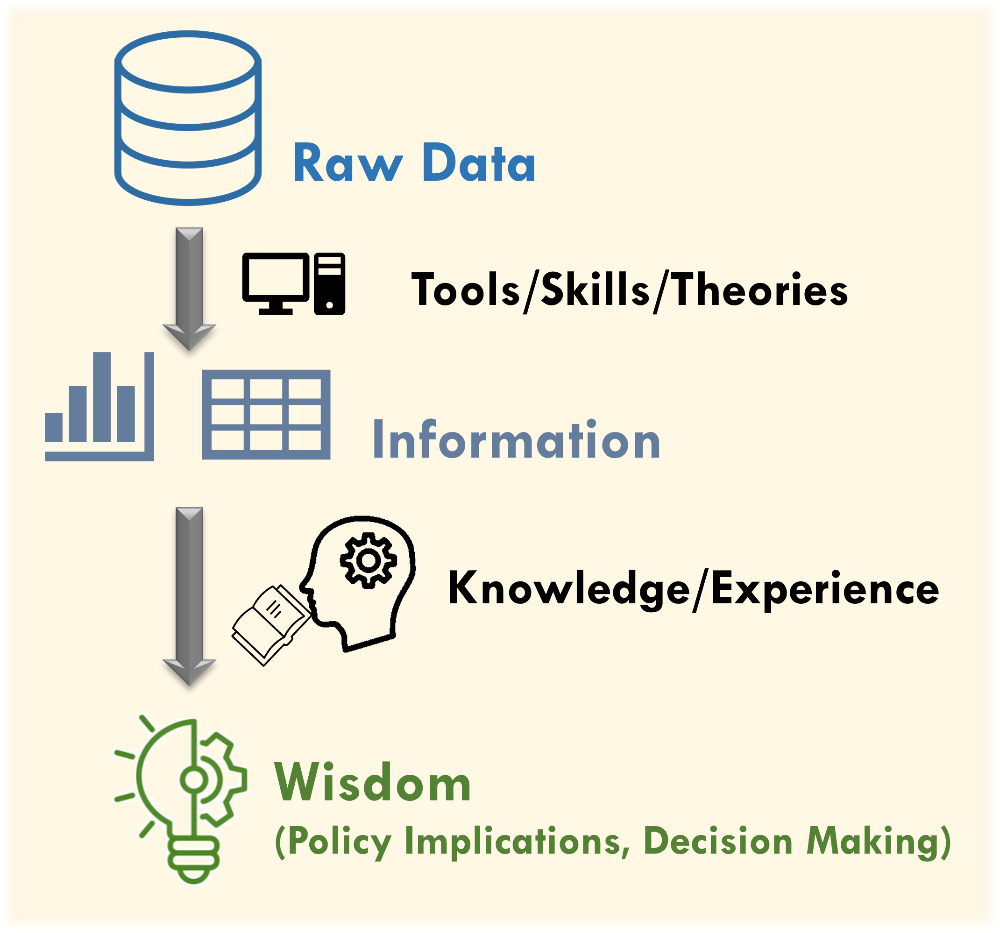
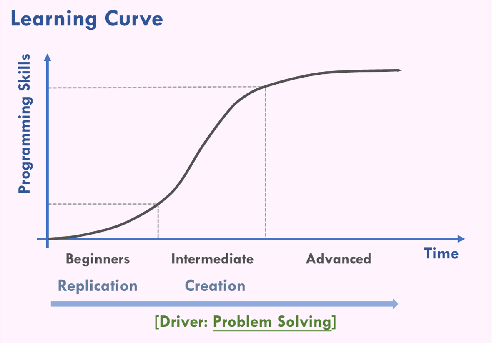

--- 
title: "Transport Analysis with R"
author: "[Chia-Jung (Robert) Yeh](https://www.linkedin.com/in/chia-jung-yeh-a04835196/) \\\n **PhD: Insitute of Transport and Logistics Studies, USYD, Australia**\\\nM.S.: Department of Transportation and Logistics Management, NYCU, Taiwan"
date: "`r Sys.Date()`"
site: bookdown::bookdown_site
output:
  bookdown::html_document2: default
  bookdown::pdf_document2: default
documentclass: book
bibliography: [book.bib, packages.bib]
biblio-style: apalike
link-citations: yes
github-repo: ChiaJung-Yeh/R-Transport-Analysis
description: "Data analysis in transport has become increasingly important in the era of big data. This book introduces the fundamentals of data analysis using R and explores its applications in the transport field. Through data analysis and data visualisation, readers learn how to organise and process data effectively while gaining a clearer understanding of data analysis strategies."
---

```{r setup1, include=FALSE}
knitr::opts_chunk$set(echo = TRUE)
library(dplyr)
library(sf)
library(ggplot2)
library(ggsflabel)
library(ggspatial)
library(knitr)
library(kableExtra)
library(TDX)
library(DT)
library(rtemps)

windowsFonts(A=windowsFont("Serif"))
```

<meta name="google-site-verification" content="i4Iib3GevuN2t_jtsNp0YabkQRXcrER03lw4OKVffco" />

# **Preface** {-}

><p style="font-size:25px;line-height:2">**Problem solving is the primary motivation for learning data analysis.**</p>  


## Introduction {-}

This book introduces methods for transport data analysis and, through practical applications, helps readers understand the characteristics of transport data, the principles underlying data analysis, and the functions of various R packages and tools. The book is organised into six chapters.

The first three chapters cover the fundamentals of data mining in R. They systematically present commonly used packages and functions for data analysis, including basic R syntax, data tidy and processing, and data visualisation. The final three chapters focus on transport data, applying the functions introduced earlier to analyse real-world datasets. These chapters cover topics such as basic statistical analysis, spatial analysis, and more advanced applications.

The book begins with a structured introduction to the essential foundations of data analysis and then moves on to a series of practical case studies that demonstrate hands-on data analysis. Through these examples, the book aims to enhance R users’ familiarity with and proficiency in applying data analysis methods within the transport domain.

```{r outline-table, echo=F, eval=T}
outline_table=data.frame(topic=c(rep("Basic Data Analysis", 3), rep("Transport Data Analysis", 3)),
                         chapter=c("[**Chapter 1** Basic Syntax in R](#basic-syntax-in-r)",
                                   "[**Chapter 2** Data Tidy and Processing](#data-tidy-and-processing)",
                                   "[**Chapter 3** Data Visualisation](#data-visualisation)",
                                   "[**Chapter 4** Statistics with R](#statistics-with-r)",
                                   "[**Chapter 5** Spatial Analysis](#spatial-analysis)",
                                   "[**Chapter 6** Extensive Applications](#extensive-applications)"))

colnames(outline_table)=c("Topic","Chapter")
kable(outline_table, booktabs=T, caption="Outline")%>%
  kable_styling(bootstrap_options=c("striped", "hover"), font_size=14)%>%
  column_spec(1, bold=T)%>%
  row_spec(0, bold=T, color="white", background="#8E8E8E")%>%
  collapse_rows(1)
```


## Mindset {-}

Data analysis is an important research method and topic in the social sciences, and the field of transport is no exception. With advances in technology, the volume of data that can be collected and stored has grown rapidly. As a result, the dimensions through which data can be analysed have become more diverse, allowing researchers to gain deeper insights into the meaning behind the data.

Data processing is a fundamental skill. Before conducting in-depth analysis or building models, it is necessary to thoroughly understand the nature of the data. Based on this understanding, the data should be organised and visualised through tables and figures in order to observe overall trends. From these observations, possible phenomena can be inferred, and initial hypotheses can then be validated using data science methods. Therefore, data processing represents the most basic stage of data analysis. How to understand data, process data efficiently, and transform it into the desired format constitutes the main focus of this book. This book aims to explore the **data processing** in data analysis and introduces the programming methods and techniques that beginners need to understand. It **<u>does not</u>** focus on the models or theoretical aspects of data science (e.g., statistical model and machine learning).

The concept of data analysis is illustrated in Figure \@ref(fig:data-information-fig). Raw data typically consist of individual records or unstructured observations. These must be processed and transformed into meaningful information, often presented in the form of tables or figures, which facilitates preliminary observation and the identification of potential trends. Finally, hypotheses are validated through model construction, and the results are interpreted using domain knowledge or professional experience. This process ultimately draws conclusions that carry policy implications and can inform decision-making. Again, the focus of this book is to develop the skills and tools needed to convert raw data into information suitable for future in-depth data analysis.

```{r data-information-fig, echo=F, eval=T, out.width="50%", fig.align="center", fig.cap="Concept of data analysis"}

```

During the process of learning data analysis, beginners often encounter confusion and obstacles without a clear direction. At this stage, it is important to keep in mind a fundamental principle: **Learning data analysis is meant to solve problems within one’s own field of study.** The emphasis should not be placed on programming efficiency or the elegance of code.

In the social sciences, greater importance is placed on the practical usefulness of data analysis and the implications that can be derived from it, rather than on the analytical process itself. Therefore, at the early stages of learning, it is advisable to learn through extensive replication on existing code and modifying it to suit one’s own research questions. This approach allows beginners to quickly become familiar with the applications of different packages and functions.

As learners progress, they often enter a stage of rapid improvement, during which they can experience significant growth and begin applying their accumulated experience to problems within their own disciplinary fields. At this point, they also gain a clearer understanding of the core purpose of programming in the context of social science research.

In summary, beginners are encouraged to treat **problem solving** as the primary motivation for learning programming. Rather than studying a programming language aimlessly without a clear application context, learning should be guided by the goal of addressing the specific questions and challenges encountered in one’s own field of study.

```{r learning-curve-fig, echo=F, eval=T, out.width="65%", fig.align="center", fig.cap="Learning curve of data analysis"}

```


## Packages Installation {-}

The main packages required for the analyses in this book and their functions are summarised in Table \@ref(tab:package-download-table). Please install them in advance by executing the follwing codes in R.

```{r package-download, echo=T, eval=F}
# Install package dplyr, data.table, ggplot2, sf, devtools
install.packages(c("dplyr", "tidyr", "data.table", "lubridate", "ggplot2", "sf", "devtools"))

# Import the package
library(dplyr)
library(tidyr)
library(data.table)
library(lubridate)
library(ggplot2)
library(sf)
library(TDX)
library(TWspdata)
```

```{r package-download-table, echo=F, eval=T}
package_table=data.frame(package=c("[`dplyr`](https://dplyr.tidyverse.org/)","[`tidyr`](https://tidyr.tidyverse.org/)", "[`data.table`](https://rdatatable.gitlab.io/data.table/)", "[`lubridate`](https://lubridate.tidyverse.org/)", "[`ggplot2`](https://ggplot2.tidyverse.org/)", "[`sf`](https://r-spatial.github.io/sf/)"),
                         package_function=c("Data analysis","Data analysis","Data analysis（particularly for big data）","Time processing","Data visualization","Spatial analysis"))

colnames(package_table)=c("Package","Function")
kable(package_table, booktabs=T, caption="Functions of the Packages")%>%
  kable_styling(bootstrap_options=c("striped", "hover"), font_size=14)%>%
  column_spec(1, bold=T)%>%
  row_spec(0, bold=T, color="white", background="#8E8E8E")
```

---

## Other Resources {-}

1. [R Preliminary](https://chiajung-yeh.github.io/R-Code-Sharing/R_Preliminary/R_Preliminary.html)
2. [Spatial Analysis with R](https://chiajung-yeh.github.io/Spatial-Analysis/)  
3. [Transport Analysis with R (Mandarin)](https://chiajung-yeh.github.io/Transport-Analysis/)


